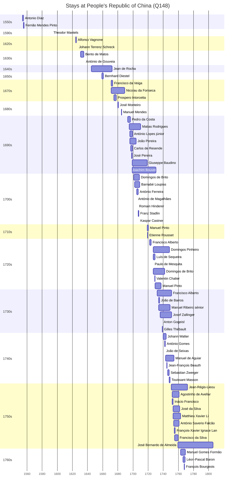

# People's Republic of China (Q148)

*country in East Asia*

Wikidata: [Q148](https://www.wikidata.org/wiki/Q148)

86 occurrence(s) across 2 transcribed value(s), 77 person(s).

**Transcribed variants:**

- `China` (85×, 1554–1767)
- `Sul da China` (1×, 1699–1699)

| Date | Variant | Person | Type | Entity id | Real entity |
|------|---------|--------|------|-----------|-------------|
| — | China | Giovanni Francesco De Ferrariis | estadia | [deh-giovanni-francesco-de-ferrariis](deh-giovanni-francesco-de-ferrariis) | — |
| — | China | João Fróis | estadia | [deh-joao-frois](deh-joao-frois) | — |
| — | China | Manuel Rodrigues | estadia | [deh-manuel-rodrigues-ii](deh-manuel-rodrigues-ii) | — |
| — | China | Matthieu Xavier Li | nacionalidade | [deh-matthieu-xavier-li](deh-matthieu-xavier-li) | — |
| 1554 | China | Antonio Díaz | estadia | [deh-antonio-diaz](deh-antonio-diaz) | — |
| 1554 | China | Belchior Nunes Barreto | estadia | [deh-antonio-diaz-ref2](deh-antonio-diaz-ref2) | [rp606650](rp606650) |
| 1555 | China | Fernão Mendes Pinto | estadia | [deh-fernao-mendes-pinto](deh-fernao-mendes-pinto) | — |
| 1556 | China | Fernão Mendes Pinto | estadia | [deh-fernao-mendes-pinto](deh-fernao-mendes-pinto) | — |
| 1593 | China | Theodor Mantels | estadia | [deh-theodor-mantels](deh-theodor-mantels) | — |
| 1609-07-25 | China | Bartolomeo Tudeschini | morte | [deh-bartolomeo-tudeschini](deh-bartolomeo-tudeschini) | [rp086162](rp086162) |
| 1610 | China | Feliciano da Silva | partida | [deh-feliciano-da-silva](deh-feliciano-da-silva) | — |
| 1624-03 | China | Alfonso Vagnone | estadia | [deh-alfonso-vagnone](deh-alfonso-vagnone) | — |
| 1626-09-21 | China | Johann Terrenz Schreck | jesuita-votos-local | [deh-johann-terrenz-schreck](deh-johann-terrenz-schreck) | — |
| 1630-10 | China | Bento de Matos | estadia | [deh-bento-de-matos](deh-bento-de-matos) | — |
| 1636 | China | António de Gouveia | estadia | [deh-antonio-de-gouvea](deh-antonio-de-gouvea) | — |
| 1645 | China | Jean de Rocha | nascimento | [deh-jean-de-rocha](deh-jean-de-rocha) | — |
| 1656 | China | Johann Grueber | partida | [deh-johann-grueber](deh-johann-grueber) | — |
| 1659 | China | Bernhard Diestel | chegada | [deh-bernhard-diestel](deh-bernhard-diestel) | — |
| 1659 | China | Christian Wolfgang Henriques Herdtrich | estadia | [deh-christian-henricus](deh-christian-henricus) | [rp669413](rp669413) |
| 1661 | China | Antonio Ferronus | morte | [deh-antonio-ferronus](deh-antonio-ferronus) | [rp773563](rp773563) |
| 1666 | China | Christian Wolfgang Henriques Herdtrich | estadia | [deh-christian-henricus](deh-christian-henricus) | [rp669413](rp669413) |
| 1671 | China | Francisco da Veiga | estadia | [deh-francisco-da-veiga](deh-francisco-da-veiga) | — |
| 1671 | China | Nicolau da Fonseca | estadia | [deh-nicolau-da-fonseca](deh-nicolau-da-fonseca) | — |
| 1674-08 | China | Prospero Intorcetta | estadia | [deh-prospero-intorcetta](deh-prospero-intorcetta) | — |
| 1680-02 | China | José Monteiro | estadia | [deh-jose-monteiro](deh-jose-monteiro) | — |
| 1684 | China | Philippe Avril | partida | [deh-philippe-avril](deh-philippe-avril) | [rp636254](rp636254) |
| 1684-10-02 | China | Manuel Mendes | chegada | [deh-manuel-mendes](deh-manuel-mendes) | [rp352197](rp352197) |
| 1691 | China | Claude de Bèze | partida | [deh-claude-de-beze](deh-claude-de-beze) | — |
| 1692 | China | Phil. Deturil | partida | [deh-phil-deturil](deh-phil-deturil) | [rp636254](rp636254) |
| 1693 | China | Pedro da Costa | estadia | [deh-pedro-da-costa-i](deh-pedro-da-costa-i) | — |
| 1695 | China | Gerard Arnould Rijckewaert | partida | [deh-gerard-arnould-rijckewaert](deh-gerard-arnould-rijckewaert) | — |
| 1695 | China | Matias Rodrigues | chegada | [deh-matias-rodrigues](deh-matias-rodrigues) | — |
| 1696 | China | António Lopes, júnior | chegada | [deh-antonio-lopes-junior](deh-antonio-lopes-junior) | — |
| 1696 | China | João Pereira | chegada | [deh-joao-pereira-ii](deh-joao-pereira-ii) | — |
| 1696 | China | Leonardo Teixeira | partida | [deh-leonardo-teixeira](deh-leonardo-teixeira) | — |
| 1696-11-13 | China | Carlos de Resende | chegada | [deh-carlos-de-resende](deh-carlos-de-resende) | — |
| 1697-11 | China | Bernard Rodes | partida | [deh-bernard-rodes](deh-bernard-rodes) | — |
| 1698-04-17 | China | José Pereira | chegada | [deh-jose-pereira](deh-jose-pereira) | — |
| 1699 | Sul da China | Giuseppe Baudino | estadia | [deh-giuseppe-baudino](deh-giuseppe-baudino) | — |
| 1699-03 | China | Joachim Bouvet | estadia | [deh-joachim-bouvet](deh-joachim-bouvet) | [rp407623](rp407623) |
| 1701 | China | Domingos de Brito | estadia | [deh-domingos-de-brito](deh-domingos-de-brito) | — |
| 1702 | China | Barnabé Loupias | estadia | [deh-barnabe-loupias](deh-barnabe-loupias) | — |
| 1702 | China | Matias Rodrigues | estadia | [deh-matias-rodrigues](deh-matias-rodrigues) | — |
| 1704-11-17 | China | António Ferreira | chegada | [deh-antonio-ferreira](deh-antonio-ferreira) | — |
| 1705 | China | António de Magalhães | estadia | [deh-antonio-de-magalhaes](deh-antonio-de-magalhaes) | — |
| 1706 | China | Romain Hinderer | chegada | [deh-romain-hinderer](deh-romain-hinderer) | — |
| 1707 | China | Franz Stadlin | chegada | [deh-franz-stadlin](deh-franz-stadlin) | — |
| 1707-07-22 | China | Kaspar Castner | chegada | [deh-kaspar-castner](deh-kaspar-castner) | — |
| 1708 | China | Barnabé Loupias | estadia | [deh-barnabe-loupias](deh-barnabe-loupias) | — |
| 1716 | China | François Noël | partida | [deh-francois-noel](deh-francois-noel) | — |
| 1719 | China | Manuel Pinto | estadia | [deh-manuel-pinto-iii](deh-manuel-pinto-iii) | — |
| 1719-06 | China | Etienne Rousset | chegada | [deh-etienne-rousset](deh-etienne-rousset) | — |
| 1722 | China | Francisco Alberto | estadia | [deh-francisco-alberto](deh-francisco-alberto) | — |
| 1726-08-26 | China | Domingos Pinheiro | chegada | [deh-domingos-pinheiro](deh-domingos-pinheiro) | — |
| 1726-08-26 | China | Luís de Sequeira | chegada | [deh-luis-de-sequeira](deh-luis-de-sequeira) | — |
| 1726-08-26 | China | Paulo de Mesquita | chegada | [deh-paulo-de-mesquita](deh-paulo-de-mesquita) | — |
| 1727 | China | Domingos de Brito | estadia | [deh-domingos-de-brito](deh-domingos-de-brito) | — |
| 1728-08-30 | China | Valentin Chalier | chegada | [deh-valentin-chalier](deh-valentin-chalier) | — |
| 1729 | China | Manuel Pinto | estadia | [deh-manuel-pinto-iii](deh-manuel-pinto-iii) | — |
| 1732 | China | Francisco Alberto | estadia | [deh-francisco-alberto](deh-francisco-alberto) | — |
| 1734 | China | Gabriel Roussel | chegada | [deh-gabriel-roussel](deh-gabriel-roussel) | [rp796803](rp796803) |
| 1734 | China | Manuel Ribeiro, sénior | estadia | [deh-manuel-ribeiro-senior](deh-manuel-ribeiro-senior) | — |
| 1734 | China | Francisco Alberto | estadia | [deh-francisco-alberto](deh-francisco-alberto) | — |
| 1734 | China | João de Barros | estadia | [deh-joao-de-barros](deh-joao-de-barros) | — |
| 1736 | China | Josef Zallinger | chegada | [deh-josef-zallinger](deh-josef-zallinger) | — |
| 1738-08-05 | China | Anton Gogeisl | chegada | [deh-anton-gogeisl](deh-anton-gogeisl) | — |
| 1738-08-07 | China | Gilles Thébault | chegada | [deh-gilles-thebault](deh-gilles-thebault) | — |
| 1740 | China | Johann Walter | estadia | [deh-johann-walter](deh-johann-walter) | — |
| 1742 | China | António Gomes | chegada | [deh-antonio-gomes](deh-antonio-gomes) | — |
| 1742 | China | João de Seixas | estadia | [deh-joao-de-seixas](deh-joao-de-seixas) | — |
| 1743 | China | Manuel de Aguiar | estadia | [deh-manuel-de-aguiar](deh-manuel-de-aguiar) | — |
| 1744-07-12 | China | Jean-François Beauth | estadia | [deh-jean-francois-beauth](deh-jean-francois-beauth) | — |
| 1746 | China | Sebastian Zwerger | chegada | [deh-sebastian-zwerger](deh-sebastian-zwerger) | — |
| 1747-12 | China | Touissant Masson | chegada | [deh-touissant-masson](deh-touissant-masson) | — |
| 1750-07-27 | China | Jean-Régis-Lieou | chegada | [deh-jean-regis-lieou](deh-jean-regis-lieou) | [rp660632](rp660632) |
| 1752 | China | Inácio Francisco | chegada | [deh-inacio-francisco](deh-inacio-francisco) | — |
| 1752 | China | Agostinho de Avellar | estadia | [deh-agostinho-de-avellar](deh-agostinho-de-avellar) | — |
| 1753 | China | José da Silva | chegada | [deh-jose-da-silva](deh-jose-da-silva) | — |
| 1753 | China | Matthieu Xavier Li | estadia | [deh-matthieu-xavier-li](deh-matthieu-xavier-li) | — |
| 1754 | China | António Saverio Falcão | chegada | [deh-antonio-saverio-falcao](deh-antonio-saverio-falcao) | — |
| 1754-08-16 | China | François-Xavier Ignace Lan | chegada | [deh-francois-xavier-ignace-lan](deh-francois-xavier-ignace-lan) | — |
| 1755 | China | Francisco da Silva | chegada | [deh-francisco-da-silva-iii](deh-francisco-da-silva-iii) | — |
| 1759-05-13 | China | José Bernardo de Almeida | estadia | [deh-jose-bernardo-de-almeida](deh-jose-bernardo-de-almeida) | — |
| 1763 | China | Manuel Gomes Formão | estadia | [deh-manuel-gomes-formao](deh-manuel-gomes-formao) | — |
| 1766 | China | Léon-Pascal Baron | estadia | [deh-leon-pascal-baron](deh-leon-pascal-baron) | — |
| 1767-08-13 | China | François Bourgeois | estadia | [deh-francois-bourgeois](deh-francois-bourgeois) | — |

### Co-presence

These persons were plausibly at this place during overlapping periods (interval estimation from stay dates; rough — see method note below).

| Period | Persons |
|--------|---------|
| 1650s | [Bernhard Diestel](deh-bernhard-diestel), [Jean de Rocha](deh-jean-de-rocha) |
| 1670s | [Francisco da Veiga](deh-francisco-da-veiga), [Jean de Rocha](deh-jean-de-rocha), [Nicolau da Fonseca](deh-nicolau-da-fonseca), [Prospero Intorcetta](deh-prospero-intorcetta) |
| 1680s | [José Monteiro](deh-jose-monteiro), [Manuel Mendes](rp352197), [Nicolau da Fonseca](deh-nicolau-da-fonseca) |
| 1690s | [António Lopes, júnior](deh-antonio-lopes-junior), [Carlos de Resende](deh-carlos-de-resende), [Giuseppe Baudino](deh-giuseppe-baudino), [Joachim Bouvet](rp407623), [José Pereira](deh-jose-pereira), [João Pereira](deh-joao-pereira-ii), [Pedro da Costa](deh-pedro-da-costa-i) |
| 1700s | [António Ferreira](deh-antonio-ferreira), [António de Magalhães](deh-antonio-de-magalhaes), [Barnabé Loupias](deh-barnabe-loupias), [Domingos de Brito](deh-domingos-de-brito), [Franz Stadlin](deh-franz-stadlin), [Giuseppe Baudino](deh-giuseppe-baudino), [Joachim Bouvet](rp407623), [João Pereira](deh-joao-pereira-ii), [Kaspar Castner](deh-kaspar-castner), [Romain Hinderer](deh-romain-hinderer) |
| 1710s | [Etienne Rousset](deh-etienne-rousset), [Joachim Bouvet](rp407623), [Manuel Pinto](deh-manuel-pinto-iii) |
| 1720s | [Domingos Pinheiro](deh-domingos-pinheiro), [Francisco Alberto](deh-francisco-alberto), [Joachim Bouvet](rp407623), [Luís de Sequeira](deh-luis-de-sequeira), [Manuel Pinto](deh-manuel-pinto-iii), [Paulo de Mesquita](deh-paulo-de-mesquita), [Valentin Chalier](deh-valentin-chalier) |
| 1730s | [Anton Gogeisl](deh-anton-gogeisl), [Domingos Pinheiro](deh-domingos-pinheiro), [Francisco Alberto](deh-francisco-alberto), [Gilles Thébault](deh-gilles-thebault), [João de Barros](deh-joao-de-barros), [Manuel Pinto](deh-manuel-pinto-iii) |
| 1740s | [António Gomes](deh-antonio-gomes), [Domingos Pinheiro](deh-domingos-pinheiro), [Francisco Alberto](deh-francisco-alberto), [Jean-François Beauth](deh-jean-francois-beauth), [Johann Walter](deh-johann-walter), [João de Seixas](deh-joao-de-seixas), [Manuel de Aguiar](deh-manuel-de-aguiar), [Sebastian Zwerger](deh-sebastian-zwerger), [Touissant Masson](deh-touissant-masson) |
| 1750s | [Agostinho de Avellar](deh-agostinho-de-avellar), [António Saverio Falcão](deh-antonio-saverio-falcao), [Francisco Alberto](deh-francisco-alberto), [Francisco da Silva](deh-francisco-da-silva-iii), [François-Xavier Ignace Lan](deh-francois-xavier-ignace-lan), [Inácio Francisco](deh-inacio-francisco), [Jean-Régis-Lieou](rp660632), [José Bernardo de Almeida](deh-jose-bernardo-de-almeida), [José da Silva](deh-jose-da-silva), [Manuel de Aguiar](deh-manuel-de-aguiar), [Matthieu Xavier Li](deh-matthieu-xavier-li) |
| 1760s | [François Bourgeois](deh-francois-bourgeois), [Jean-Régis-Lieou](rp660632), [José Bernardo de Almeida](deh-jose-bernardo-de-almeida), [Léon-Pascal Baron](deh-leon-pascal-baron), [Manuel Gomes Formão](deh-manuel-gomes-formao) |

*143 overlapping pair(s) involving 50 person(s). Method: interval start = stay event date; end = next embarque/partida/different-place event, or death, or +15yr cap.*

