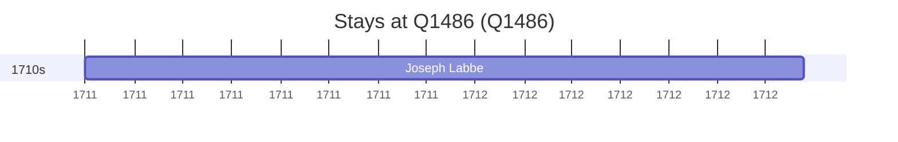

# Q1486

*(fetch error: HTTP Error 429: Too Many Requests)*

Wikidata: [Q1486](https://www.wikidata.org/wiki/Q1486)

1 occurrence(s) across 1 transcribed value(s), 1 person(s).

**Transcribed variants:**

- `Buenos Aires` (1×, 1711–1711)

| Date | Variant | Person | Type | Entity id | Real entity |
|------|---------|--------|------|-----------|-------------|
| 1711-05-01 | Buenos Aires | Joseph Labbe | estadia | [deh-joseph-labbe](deh-joseph-labbe) | — |

