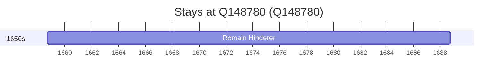

# Q148780

*(fetch error: HTTP Error 429: Too Many Requests)*

Wikidata: [Q148780](https://www.wikidata.org/wiki/Q148780)

1 occurrence(s) across 1 transcribed value(s), 1 person(s).

**Transcribed variants:**

- `Reiningue` (1×, 1658–1658)

| Date | Variant | Person | Type | Entity id | Real entity |
|------|---------|--------|------|-----------|-------------|
| 1658-09-12 | Reiningue | Romain Hinderer | nascimento | [deh-romain-hinderer](deh-romain-hinderer) | — |

