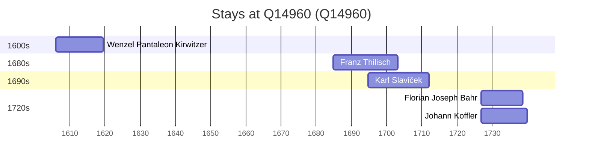

# Q14960

*(fetch error: HTTP Error 429: Too Many Requests)*

Wikidata: [Q14960](https://www.wikidata.org/wiki/Q14960)

5 occurrence(s) across 1 transcribed value(s), 5 person(s).

**Transcribed variants:**

- `Brno` (5×, 1606–1726)

| Date | Variant | Person | Type | Entity id | Real entity |
|------|---------|--------|------|-----------|-------------|
| 1606 | Brno | Wenzel Pantaleon Kirwitzer | jesuita-entrada | [deh-wenzel-pantaleon-kirwitzer](deh-wenzel-pantaleon-kirwitzer) | — |
| 1684-10-01 | Brno | Franz Thilisch | jesuita-entrada | [deh-franz-thilisch](deh-franz-thilisch) | — |
| 1694-10-09 | Brno | Karl Slaviček | jesuita-entrada | [deh-karl-slavicek](deh-karl-slavicek) | — |
| 1726-10-09 | Brno | Florian Joseph Bahr | jesuita-entrada | [deh-florian-joseph-bahr](deh-florian-joseph-bahr) | — |
| 1726-10-09 | Brno | Johann Koffler | jesuita-entrada | [deh-johann-koffler](deh-johann-koffler) | — |

### Co-presence

These persons were plausibly at this place during overlapping periods (interval estimation from stay dates; rough — see method note below).

| Period | Persons |
|--------|---------|
| 1690s | [Franz Thilisch](deh-franz-thilisch), [Karl Slaviček](deh-karl-slavicek) |
| 1720s | [Florian Joseph Bahr](deh-florian-joseph-bahr), [Johann Koffler](deh-johann-koffler) |

*2 overlapping pair(s) involving 4 person(s). Method: interval start = stay event date; end = next embarque/partida/different-place event, or death, or +15yr cap.*

