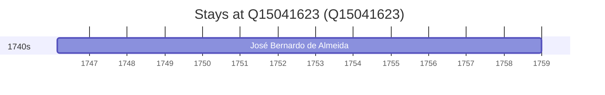

# Q15041623

*(fetch error: HTTP Error 429: Too Many Requests)*

Wikidata: [Q15041623](https://www.wikidata.org/wiki/Q15041623)

1 occurrence(s) across 1 transcribed value(s), 1 person(s).

**Transcribed variants:**

- `Lisboa` (1×, 1746–1746)

| Date | Variant | Person | Type | Entity id | Real entity |
|------|---------|--------|------|-----------|-------------|
| 1746-02-23 | Lisboa | José Bernardo de Almeida | jesuita-entrada | [deh-jose-bernardo-de-almeida](deh-jose-bernardo-de-almeida) | — |

