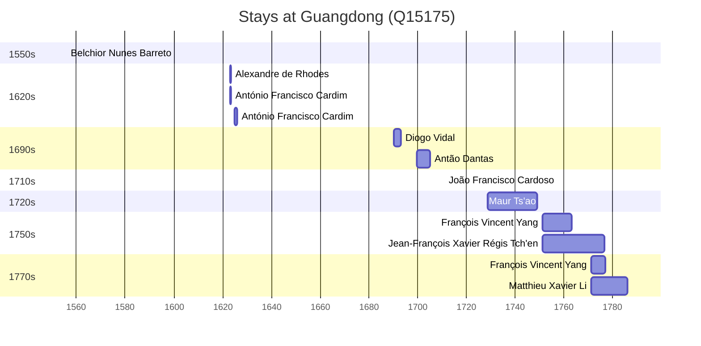

# Guangdong (Q15175)

*province of China*

Wikidata: [Q15175](https://www.wikidata.org/wiki/Q15175)

17 occurrence(s) across 5 transcribed value(s), 13 person(s).

**Transcribed variants:**

- `Kwangtung` (12×, 1555–1771)
- `Macau` (1×, 1623–1623)
- `Kouang-tong` (2×, 1690–1728)
- `Kwangtung, China` (1×, 1699–1699)
- `Molucas` (1×, undated)

| Date | Variant | Person | Type | Entity id | Real entity |
|------|---------|--------|------|-----------|-------------|
| — | Kwangtung | Carlo Giovanni Turcotti | estadia | [deh-carlo-giovanni-turcotti](deh-carlo-giovanni-turcotti) | — |
| — | Kwangtung | Pierre Vincent de Tartre | estadia | [deh-pierre-vincent-de-tartre](deh-pierre-vincent-de-tartre) | — |
| — | Kwangtung | Wenzel Pantaleon Kirwitzer | estadia | [deh-wenzel-pantaleon-kirwitzer](deh-wenzel-pantaleon-kirwitzer) | — |
| 1555-11-23 | Kwangtung | Belchior Nunes Barreto | estadia | [deh-belchior-nunes-barreto](deh-belchior-nunes-barreto) | [rp606650](rp606650) |
| 1623 | Kwangtung | António Francisco Cardim | estadia | [deh-antonio-francisco-cardim](deh-antonio-francisco-cardim) | [rp536947](rp536947) |
| 1623-05-29 | Macau | António Francisco Cardim | estadia | [deh-antonio-francisco-cardim](deh-antonio-francisco-cardim) | [rp536947](rp536947) |
| 1625 | Kwangtung | António Francisco Cardim | estadia | [deh-antonio-francisco-cardim](deh-antonio-francisco-cardim) | [rp536947](rp536947) |
| 1690 | Kouang-tong | Diogo Vidal | estadia | [deh-diogo-vidal](deh-diogo-vidal) | — |
| 1699-10 | Kwangtung, China | Antão Dantas | chegada | [deh-antao-dantas](deh-antao-dantas) | — |
| 1711 | Kwangtung | João Francisco Cardoso | estadia | [deh-joao-francisco-cardoso](deh-joao-francisco-cardoso) | — |
| 1728-10-18 | Kouang-tong | Maur Ts'ao | nascimento | [deh-maur-tsao](deh-maur-tsao) | — |
| 1751 | Kwangtung | François Vincent Yang | estadia | [deh-francois-vincent-yang](deh-francois-vincent-yang) | — |
| 1751 | Kwangtung | Jean-François Xavier Régis Tch'en | estadia | [deh-jean-francois-xavier-regis-tchen](deh-jean-francois-xavier-regis-tchen) | — |
| 1753 | Kwangtung | François Vincent Yang | estadia | [deh-francois-vincent-yang](deh-francois-vincent-yang) | — |
| 1771 | Kwangtung | François Vincent Yang | estadia | [deh-francois-vincent-yang](deh-francois-vincent-yang) | — |
| 1771 | Kwangtung | Matthieu Xavier Li | estadia | [deh-matthieu-xavier-li](deh-matthieu-xavier-li) | — |
| <1623 | Molucas | Alexandre de Rhodes | estadia | [deh-alexandre-de-rhodes](deh-alexandre-de-rhodes) | — |

### Co-presence

These persons were plausibly at this place during overlapping periods (interval estimation from stay dates; rough — see method note below).

| Period | Persons |
|--------|---------|
| 1620s | [Alexandre de Rhodes](deh-alexandre-de-rhodes), [António Francisco Cardim](rp536947) |
| 1750s | [François Vincent Yang](deh-francois-vincent-yang), [Jean-François Xavier Régis Tch'en](deh-jean-francois-xavier-regis-tchen) |
| 1770s | [François Vincent Yang](deh-francois-vincent-yang), [Jean-François Xavier Régis Tch'en](deh-jean-francois-xavier-regis-tchen) |

*3 overlapping pair(s) involving 4 person(s). Method: interval start = stay event date; end = next embarque/partida/different-place event, or death, or +15yr cap.*

