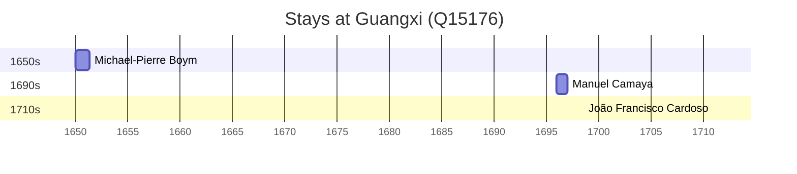

# Guangxi (Q15176)

*Provincial area of China organized in 1958 as an autonomous region for the Zhuang people*

Wikidata: [Q15176](https://www.wikidata.org/wiki/Q15176)

6 occurrence(s) across 2 transcribed value(s), 6 person(s).

**Transcribed variants:**

- `Kwangsi (corte de Yong-li)` (1×, 1650–1650)
- `Kwangsi` (5×, 1652–1711)

| Date | Variant | Person | Type | Entity id | Real entity |
|------|---------|--------|------|-----------|-------------|
| — | Kwangsi | Domingos de Brito | estadia | [deh-domingos-de-brito](deh-domingos-de-brito) | — |
| — | Kwangsi | Pierre Vincent de Tartre | estadia | [deh-pierre-vincent-de-tartre](deh-pierre-vincent-de-tartre) | — |
| 1650 | Kwangsi (corte de Yong-li) | Michael-Pierre Boym | estadia | [deh-michael-pierre-boym](deh-michael-pierre-boym) | — |
| 1652-12-12 | Kwangsi | Andreas Wolfgang Koffler | morte | [deh-andreas-wolfgang-koffler](deh-andreas-wolfgang-koffler) | — |
| 1696 | Kwangsi | Manuel Camaya | chegada | [deh-manuel-camaya](deh-manuel-camaya) | — |
| 1711 | Kwangsi | João Francisco Cardoso | estadia | [deh-joao-francisco-cardoso](deh-joao-francisco-cardoso) | — |

