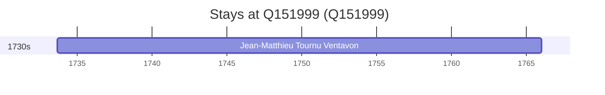

# Q151999

*(fetch error: HTTP Error 429: Too Many Requests)*

Wikidata: [Q151999](https://www.wikidata.org/wiki/Q151999)

1 occurrence(s) across 1 transcribed value(s), 1 person(s).

**Transcribed variants:**

- `Gap` (1×, 1733–1733)

| Date | Variant | Person | Type | Entity id | Real entity |
|------|---------|--------|------|-----------|-------------|
| 1733-09-12 | Gap | Jean-Matthieu Tournu Ventavon | nascimento | [deh-jean-matthieu-tournu-ventavon](deh-jean-matthieu-tournu-ventavon) | — |

