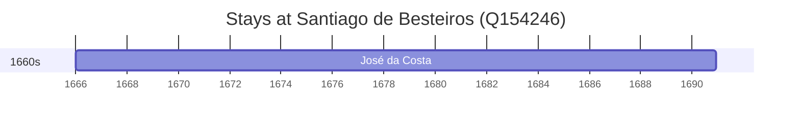

# Santiago de Besteiros (Q154246)

*civil parish in Tondela*

Wikidata: [Q154246](https://www.wikidata.org/wiki/Q154246)

1 occurrence(s) across 1 transcribed value(s), 1 person(s).

**Transcribed variants:**

- `Santiago de Besteiros` (1×, 1666–1666)

| Date | Variant | Person | Type | Entity id | Real entity |
|------|---------|--------|------|-----------|-------------|
| 1666 | Santiago de Besteiros | José da Costa | nascimento | [deh-giovanni-giuseppe-costa-ref1](deh-giovanni-giuseppe-costa-ref1) | — |

