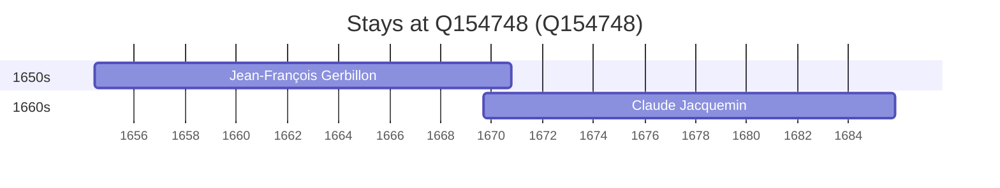

# Q154748

*(fetch error: HTTP Error 429: Too Many Requests)*

Wikidata: [Q154748](https://www.wikidata.org/wiki/Q154748)

2 occurrence(s) across 1 transcribed value(s), 2 person(s).

**Transcribed variants:**

- `Verdun` (2×, 1654–1669)

| Date | Variant | Person | Type | Entity id | Real entity |
|------|---------|--------|------|-----------|-------------|
| 1654-06-11 | Verdun | Jean-François Gerbillon | nascimento | [deh-jean-francois-gerbillon](deh-jean-francois-gerbillon) | — |
| 1669-09-03 | Verdun | Claude Jacquemin | nascimento | [deh-claude-jacquemin](deh-claude-jacquemin) | — |

### Co-presence

These persons were plausibly at this place during overlapping periods (interval estimation from stay dates; rough — see method note below).

| Period | Persons |
|--------|---------|
| 1660s | [Claude Jacquemin](deh-claude-jacquemin), [Jean-François Gerbillon](deh-jean-francois-gerbillon) |

*1 overlapping pair(s) involving 2 person(s). Method: interval start = stay event date; end = next embarque/partida/different-place event, or death, or +15yr cap.*

