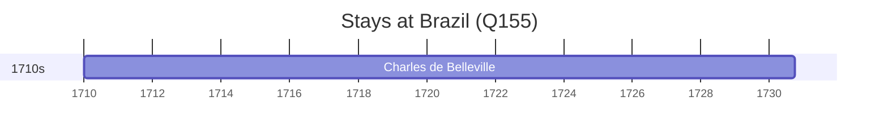

# Brazil (Q155)

*country in South America*

Wikidata: [Q155](https://www.wikidata.org/wiki/Q155)

3 occurrence(s) across 2 transcribed value(s), 3 person(s).

**Transcribed variants:**

- `[No mar, perto do Brasil]` (1×, 1680–1680)
- `Brasil` (2×, 1710–1758)

| Date | Variant | Person | Type | Entity id | Real entity |
|------|---------|--------|------|-----------|-------------|
| 1680-06-04 | [No mar, perto do Brasil] | Adam Weidenfied | morte | [deh-adam-weidenfied](deh-adam-weidenfied) | — |
| 1710 | Brasil | Charles de Belleville | estadia | [deh-charles-de-belleville](deh-charles-de-belleville) | [rp033271](rp033271) |
| 1758 | Brasil | João Simões | partida | [deh-joao-simoes](deh-joao-simoes) | — |

