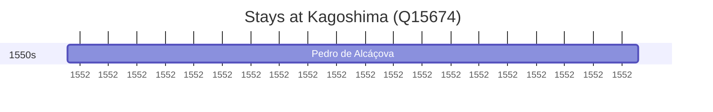

# Kagoshima (Q15674)

*capital city of Kagoshima prefecture*

Wikidata: [Q15674](https://www.wikidata.org/wiki/Q15674)

1 occurrence(s) across 1 transcribed value(s), 1 person(s).

**Transcribed variants:**

- `Kagoshima` (1×, 1552–1552)

| Date | Variant | Person | Type | Entity id | Real entity |
|------|---------|--------|------|-----------|-------------|
| 1552-08-14 | Kagoshima | Pedro de Alcáçova | estadia | [deh-pedro-de-alcacova](deh-pedro-de-alcacova) | — |

