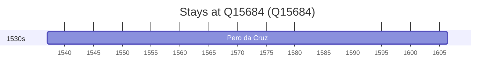

# Q15684

*(fetch error: HTTP Error 429: Too Many Requests)*

Wikidata: [Q15684](https://www.wikidata.org/wiki/Q15684)

1 occurrence(s) across 1 transcribed value(s), 1 person(s).

**Transcribed variants:**

- `Segóvia` (1×, 1537–1537)

| Date | Variant | Person | Type | Entity id | Real entity |
|------|---------|--------|------|-----------|-------------|
| 1537 | Segóvia | Pero da Cruz | nascimento | [deh-pero-da-cruz](deh-pero-da-cruz) | — |

