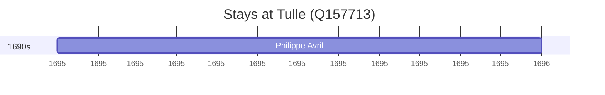

# Tulle (Q157713)

*commune in Corrèze, France*

Wikidata: [Q157713](https://www.wikidata.org/wiki/Q157713)

1 occurrence(s) across 1 transcribed value(s), 1 person(s).

**Transcribed variants:**

- `Tulle` (1×, 1695–1695)

| Date | Variant | Person | Type | Entity id | Real entity |
|------|---------|--------|------|-----------|-------------|
| 1695 | Tulle | Philippe Avril | estadia | [deh-philippe-avril](deh-philippe-avril) | [rp636254](rp636254) |

