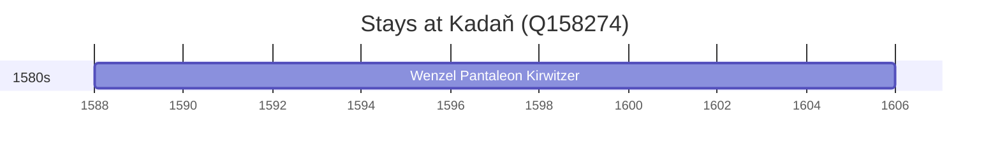

# Kadaň (Q158274)

*town in the Czech Republic*

Wikidata: [Q158274](https://www.wikidata.org/wiki/Q158274)

1 occurrence(s) across 1 transcribed value(s), 1 person(s).

**Transcribed variants:**

- `Kadaň, Boémia` (1×, 1588–1588)

| Date | Variant | Person | Type | Entity id | Real entity |
|------|---------|--------|------|-----------|-------------|
| 1588 | Kadaň, Boémia | Wenzel Pantaleon Kirwitzer | nascimento | [deh-wenzel-pantaleon-kirwitzer](deh-wenzel-pantaleon-kirwitzer) | — |

