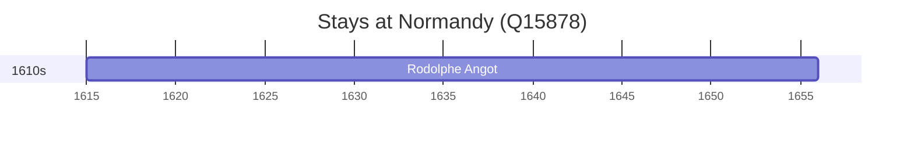

# Normandy (Q15878)

*geographical and cultural region which extends over a part of France and the British Channel Islands*

Wikidata: [Q15878](https://www.wikidata.org/wiki/Q15878)

1 occurrence(s) across 1 transcribed value(s), 1 person(s).

**Transcribed variants:**

- `Normandia` (1×, 1615–1615)

| Date | Variant | Person | Type | Entity id | Real entity |
|------|---------|--------|------|-----------|-------------|
| 1615 | Normandia | Rodolphe Angot | nascimento | [deh-rodolphe-angot](deh-rodolphe-angot) | — |

