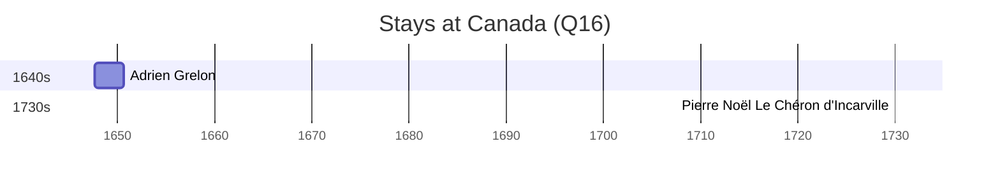

# Canada (Q16)

*country in North America*

Wikidata: [Q16](https://www.wikidata.org/wiki/Q16)

2 occurrence(s) across 1 transcribed value(s), 2 person(s).

**Transcribed variants:**

- `Canadá` (2×, 1647–1730)

| Date | Variant | Person | Type | Entity id | Real entity |
|------|---------|--------|------|-----------|-------------|
| 1647-08-14:1650-08-23 | Canadá | Adrien Grelon | estadia | [deh-adrien-grelon](deh-adrien-grelon) | — |
| 1730 | Canadá | Pierre Noël Le Chéron d'Incarville | chegada | [deh-pierre-noel-le-cheron-dincarville](deh-pierre-noel-le-cheron-dincarville) | — |

