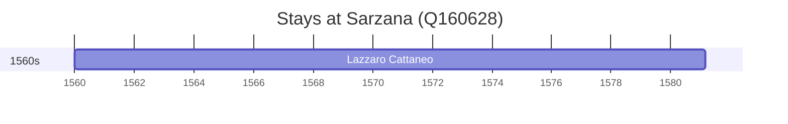

# Sarzana (Q160628)

*Italian comune*

Wikidata: [Q160628](https://www.wikidata.org/wiki/Q160628)

1 occurrence(s) across 1 transcribed value(s), 1 person(s).

**Transcribed variants:**

- `Sarzana` (1×, 1560–1560)

| Date | Variant | Person | Type | Entity id | Real entity |
|------|---------|--------|------|-----------|-------------|
| 1560 | Sarzana | Lazzaro Cattaneo | nascimento | [deh-lazzaro-cattaneo](deh-lazzaro-cattaneo) | — |

