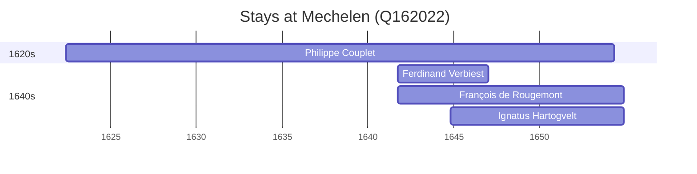

# Mechelen (Q162022)

*city in the province of Antwerp, Belgium*

Wikidata: [Q162022](https://www.wikidata.org/wiki/Q162022)

4 occurrence(s) across 1 transcribed value(s), 4 person(s).

**Transcribed variants:**

- `Mechelen` (4×, 1622–1644)

| Date | Variant | Person | Type | Entity id | Real entity |
|------|---------|--------|------|-----------|-------------|
| 1622-05-31 | Mechelen | Philippe Couplet | nascimento | [deh-philippe-couplet](deh-philippe-couplet) | [rp551005](rp551005) |
| 1641-09-29 | Mechelen | Ferdinand Verbiest | jesuita-entrada | [deh-ferdinand-verbiest](deh-ferdinand-verbiest) | [rp339905](rp339905) |
| 1641-09-29 | Mechelen | François de Rougemont | jesuita-entrada | [deh-francois-de-rougemont](deh-francois-de-rougemont) | — |
| 1644-10-30 | Mechelen | Ignatus Hartogvelt | jesuita-entrada | [deh-ignatus-hartogvelt](deh-ignatus-hartogvelt) | — |

### Co-presence

These persons were plausibly at this place during overlapping periods (interval estimation from stay dates; rough — see method note below).

| Period | Persons |
|--------|---------|
| 1640s | [Ferdinand Verbiest](rp339905), [François de Rougemont](deh-francois-de-rougemont), [Ignatus Hartogvelt](deh-ignatus-hartogvelt), [Philippe Couplet](rp551005) |

*6 overlapping pair(s) involving 4 person(s). Method: interval start = stay event date; end = next embarque/partida/different-place event, or death, or +15yr cap.*

