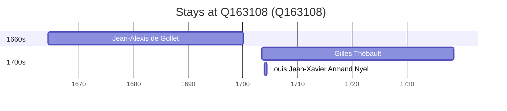

# Q163108

*(fetch error: HTTP Error 429: Too Many Requests)*

Wikidata: [Q163108](https://www.wikidata.org/wiki/Q163108)

3 occurrence(s) across 1 transcribed value(s), 3 person(s).

**Transcribed variants:**

- `Saint-Malo` (3×, 1664–1703)

| Date | Variant | Person | Type | Entity id | Real entity |
|------|---------|--------|------|-----------|-------------|
| 1664-05-04 | Saint-Malo | Jean-Alexis de Gollet | nascimento | [deh-jean-alexis-de-gollet](deh-jean-alexis-de-gollet) | — |
| 1703-07 | Saint-Malo | Gilles Thébault | nascimento | [deh-gilles-thebault](deh-gilles-thebault) | — |
| 1703-12-26 | Saint-Malo | Louis Jean-Xavier Armand Nyel | estadia | [deh-louis-jean-xavier-armand-nyel](deh-louis-jean-xavier-armand-nyel) | — |

### Co-presence

These persons were plausibly at this place during overlapping periods (interval estimation from stay dates; rough — see method note below).

| Period | Persons |
|--------|---------|
| 1700s | [Gilles Thébault](deh-gilles-thebault), [Louis Jean-Xavier Armand Nyel](deh-louis-jean-xavier-armand-nyel) |

*1 overlapping pair(s) involving 2 person(s). Method: interval start = stay event date; end = next embarque/partida/different-place event, or death, or +15yr cap.*

