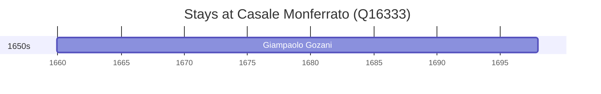

# Casale Monferrato (Q16333)

*town in the Piedmont region in Italy*

Wikidata: [Q16333](https://www.wikidata.org/wiki/Q16333)

1 occurrence(s) across 1 transcribed value(s), 1 person(s).

**Transcribed variants:**

- `Casale Monferrato` (1×, 1659–1659)

| Date | Variant | Person | Type | Entity id | Real entity |
|------|---------|--------|------|-----------|-------------|
| 1659-12-02 | Casale Monferrato | Giampaolo Gozani | nascimento | [deh-giampaolo-gozani](deh-giampaolo-gozani) | — |

