# Guangzhou (Q16572)

*capital city of Guangdong Province, China*

Wikidata: [Q16572](https://www.wikidata.org/wiki/Q16572)

232 occurrence(s) across 11 transcribed value(s), 143 person(s).

**Transcribed variants:**

- `Cantão` (218×, 1555–1785)
- `Cantão (feira)` (5×, 1564–1581)
- `Cantão (missão)` (1×, 1663–1663)
- `Guangzhou` (1×, 1684–1684)
- `Cantão (residência francesa)` (1×, 1692–1692)
- `Cantão (porto, navio Amphitrite)` (1×, 1699–1699)
- `[Costa de Cantão]` (1×, 1701–1701)
- `Cantão (in sancello resid. Gallicae S.J.)` (1×, 1706–1706)
- `Cantão (igreja de Ty-lo-po)` (1×, 1708–1708)
- `Cantão (igreja Ti-lo-pu)` (1×, 1710–1710)
- `Tonquim` (1×, undated)

| Date | Variant | Person | Type | Entity id | Real entity |
|------|---------|--------|------|-----------|-------------|
| — | Cantão | Claude Motel | estadia | [deh-claude-motel](deh-claude-motel) | — |
| — | Cantão | Diogo de Sotomaior | estadia | [deh-diogo-de-sotomaior](deh-diogo-de-sotomaior) | — |
| — | Cantão | Diogo Vidal | estadia | [deh-diogo-vidal](deh-diogo-vidal) | — |
| — | Cantão | Domingos de Brito | estadia | [deh-domingos-de-brito](deh-domingos-de-brito) | — |
| — | Cantão | Giovanni Laureati | estadia | [deh-giovanni-laureati](deh-giovanni-laureati) | [rp323905](rp323905) |
| — | Cantão | Jacques Motel | estadia | [deh-jacques-motel](deh-jacques-motel) | — |
| — | Cantão | Joachim Bouvet | estadia | [deh-joachim-bouvet](deh-joachim-bouvet) | [rp407623](rp407623) |
| — | Cantão | Joseph Le Quesne | partida | [deh-joseph-le-quesne](deh-joseph-le-quesne) | — |
| — | Cantão | Joseph Marie Anne de Moyriac Mailla | estadia | [deh-joseph-marie-anne-de-moyriac-mailla](deh-joseph-marie-anne-de-moyriac-mailla) | — |
| — | Cantão | Louis Jean-Xavier Armand Nyel | estadia | [deh-louis-jean-xavier-armand-nyel](deh-louis-jean-xavier-armand-nyel) | — |
| — | Cantão | Manuel de Sousa | estadia | [deh-manuel-de-sousa](deh-manuel-de-sousa) | — |
| 1555 | Cantão | Estêvão de Góis | estadia | [deh-estevao-de-gois](deh-estevao-de-gois) | — |
| 1555 | Cantão | Belchior Nunes Barreto | estadia | [deh-belchior-nunes-barreto](deh-belchior-nunes-barreto) | [rp606650](rp606650) |
| 1556 | Cantão | Belchior Nunes Barreto | estadia | [deh-belchior-nunes-barreto](deh-belchior-nunes-barreto) | [rp606650](rp606650) |
| 1556-06 | Cantão | Estêvão de Góis | estadia | [deh-estevao-de-gois](deh-estevao-de-gois) | — |
| 1557 | Cantão | Estêvão de Góis | estadia | [deh-estevao-de-gois](deh-estevao-de-gois) | — |
| 1562-04 | Cantão | Francisco Pérez | partida | [deh-francisco-perez](deh-francisco-perez) | [rp892854](rp892854) |
| 1564-11-18 | Cantão (feira) | Manuel Teixeira | estadia | [deh-manuel-teixeira](deh-manuel-teixeira) | [rp212210](rp212210) |
| 1564-11-30 | Cantão | André Pinto | estadia | [deh-andre-pinto](deh-andre-pinto) | — |
| 1564-12-01 | Cantão (feira) | Manuel Teixeira | estadia | [deh-manuel-teixeira](deh-manuel-teixeira) | [rp212210](rp212210) |
| 1565-11-21 | Cantão | Francisco Pérez | estadia | [deh-francisco-perez](deh-francisco-perez) | [rp892854](rp892854) |
| 1565-11-21 | Cantão (feira) | Manuel Teixeira | estadia | [deh-manuel-teixeira](deh-manuel-teixeira) | [rp212210](rp212210) |
| 1565-12 | Cantão (feira) | Manuel Teixeira | estadia | [deh-manuel-teixeira](deh-manuel-teixeira) | [rp212210](rp212210) |
| 1568-05-09 | Cantão | Juan Baptista de Ribera | estadia | [deh-juan-baptista-de-ribera](deh-juan-baptista-de-ribera) | — |
| 1569 | Cantão | Belchior Miguel Carneiro Leitão | estadia | [deh-belchior-miguel-carneiro-leitao](deh-belchior-miguel-carneiro-leitao) | [rp973077](rp973077) |
| 1574-02-07 | Cantão | António Vaz | estadia | [deh-antonio-vaz-ref1](deh-antonio-vaz-ref1) | — |
| 1574-03-20 | Cantão | António Vaz | estadia | [deh-antonio-vaz-ref1](deh-antonio-vaz-ref1) | — |
| 1575 | Cantão | Belchior Miguel Carneiro Leitão | estadia | [deh-belchior-miguel-carneiro-leitao](deh-belchior-miguel-carneiro-leitao) | [rp973077](rp973077) |
| 1575 | Cantão | Cristóvão da Costa | estadia | [deh-cristovao-da-costa](deh-cristovao-da-costa) | — |
| 1580-04 | Cantão | Michele (Pompilio) Ruggiere | estadia | [deh-michele-ruggiere](deh-michele-ruggiere) | — |
| 1581 | Cantão | André Pinto | estadia | [deh-andre-pinto](deh-andre-pinto) | — |
| 1581-04 | Cantão (feira) | Francisco Pires | estadia | [deh-francisco-pires](deh-francisco-pires) | — |
| 1581-10 | Cantão | Michele (Pompilio) Ruggiere | estadia | [deh-michele-ruggiere](deh-michele-ruggiere) | — |
| 1582-05-02 | Cantão | Alonso Sanchéz | estadia | [deh-alonso-sanchez](deh-alonso-sanchez) | — |
| 1582-05-29 | Cantão | Alonso Sanchéz | estadia | [deh-alonso-sanchez](deh-alonso-sanchez) | — |
| 1583-07 | Cantão | Alonso Sanchéz | estadia | [deh-alonso-sanchez](deh-alonso-sanchez) | — |
| 1583-08 | Cantão | Matteo Ricci | estadia | [deh-matteo-ricci](deh-matteo-ricci) | [rp302155](rp302155) |
| 1585-10-08 | Cantão | António de Almeida | estadia | [deh-antonio-de-almeida](deh-antonio-de-almeida) | — |
| 1593 | Cantão | Chrysostome Fou Yuan | nascimento | [deh-chrysostome-fou-yuan](deh-chrysostome-fou-yuan) | — |
| 1596-05-04 | Cantão | Diogo Pinto | estadia | [deh-diogo-pinto](deh-diogo-pinto) | — |
| 1596-05-26 | Cantão | Lazzaro Cattaneo | jesuita-votos-local | [deh-lazzaro-cattaneo](deh-lazzaro-cattaneo) | — |
| 1600 | Cantão | Christophe | nascimento | [deh-christophe](deh-christophe) | — |
| 1611 | Cantão | Domingos Mendes K'ieou | estadia | [deh-domingos-mendes-kieou](deh-domingos-mendes-kieou) | — |
| 1617-03-18 | Cantão | Sabatino De Ursis | partida | [deh-sabatino-de-ursis](deh-sabatino-de-ursis) | — |
| 1617-03-18 | Cantão | Diego Pantoja | partida | [deh-sabatino-de-ursis-ref2](deh-sabatino-de-ursis-ref2) | — |
| 1617-04-30 | Cantão | Alfonso Vagnone | partida | [deh-alfonso-vagnone](deh-alfonso-vagnone) | — |
| 1618 | Cantão | Alfonso Vagnone | chegada | [deh-alfonso-vagnone](deh-alfonso-vagnone) | — |
| 1645 | Cantão | Andreas Wolfgang Koffler | estadia | [deh-andreas-wolfgang-koffler](deh-andreas-wolfgang-koffler) | — |
| 1647-10-04 | Cantão | Bartolomeu de Roboredo | morte | [deh-bartolomeu-de-roboredo](deh-bartolomeu-de-roboredo) | — |
| 1648 | Cantão | Francesco Sambiasi | estadia | [deh-francesco-sambiasi](deh-francesco-sambiasi) | — |
| 1648 | Cantão | Gaspar Ferreira | estadia | [deh-gaspar-ferreira](deh-gaspar-ferreira) | — |
| 1649 | Cantão | Álvaro Semedo | estadia | [deh-alvaro-semedo](deh-alvaro-semedo) | — |
| 1649-01 | Cantão | Francesco Sambiasi | morte | [deh-francesco-sambiasi](deh-francesco-sambiasi) | — |
| 1649-08-24 | Cantão | Andreas Wolfgang Koffler | jesuita-votos-local | [deh-andreas-wolfgang-koffler](deh-andreas-wolfgang-koffler) | — |
| 1649-12-27 | Cantão | Gaspar Ferreira | morte | [deh-gaspar-ferreira](deh-gaspar-ferreira) | — |
| 1650-12 | Cantão | Álvaro Semedo | estadia | [deh-alvaro-semedo](deh-alvaro-semedo) | — |
| 1658-07-18 | Cantão | Álvaro Semedo | morte | [deh-alvaro-semedo](deh-alvaro-semedo) | — |
| 1663-03-19 | Cantão (missão) | José de Almeida | estadia | [deh-jose-de-almeida-i](deh-jose-de-almeida-i) | — |
| 1664 | Cantão | Baltasar Diego da Rocha | chegada | [deh-baltasar-diego-da-rocha](deh-baltasar-diego-da-rocha) | — |
| 1664 | Cantão | José de Magalhães | estadia | [deh-jose-de-magalhaes](deh-jose-de-magalhaes) | — |
| 1664-09-14 | Cantão | Christian Wolfgang Henriques Herdtrich | estadia | [deh-christian-wolfgang-henriques-herdtrich](deh-christian-wolfgang-henriques-herdtrich) | [rp669413](rp669413) |
| 1665 | Cantão | António de Gouveia | estadia | [deh-antonio-de-gouvea](deh-antonio-de-gouvea) | — |
| 1665 | Cantão | Diogo de Sotomaior | estadia | [deh-diogo-de-sotomaior](deh-diogo-de-sotomaior) | — |
| 1665 | Cantão | François de Rougemont | estadia | [deh-francois-de-rougemont](deh-francois-de-rougemont) | — |
| 1665 | Cantão | Giandomenico Gabiani | partida | [deh-giandomenico-gabiani](deh-giandomenico-gabiani) | [rp565060](rp565060) |
| 1665 | Cantão | Feliciano Pacheco | estadia | [deh-feliciano-pacheco](deh-feliciano-pacheco) | — |
| 1665 | Cantão | Manuel Jorge | estadia | [deh-manuel-jorge](deh-manuel-jorge) | — |
| 1665-09-17 | Cantão | Francesco Brancati | partida | [deh-francesco-brancati](deh-francesco-brancati) | — |
| 1666-03-29 | Cantão | Andrea-Giovanni Lubelli | chegada | [deh-andrea-giovanni-lubelli](deh-andrea-giovanni-lubelli) | — |
| 1666-03-25 | Cantão | Germain Macret | estadia | [deh-germain-macret](deh-germain-macret) | — |
| 1666-03-25 | Cantão | Giandomenico Gabiani | chegada | [deh-giandomenico-gabiani](deh-giandomenico-gabiani) | [rp565060](rp565060) |
| 1666-10 | Cantão | Prospero Intorcetta | estadia | [deh-prospero-intorcetta](deh-prospero-intorcetta) | — |
| 1667-09-30 | Cantão | Michel Trigault | morte | [deh-michel-trigault](deh-michel-trigault) | — |
| 1667-10-01 | Cantão | Michel Trigault | estadia | [deh-michel-trigault](deh-michel-trigault) | — |
| 1667-12-18 | Cantão | Feliciano Pacheco | estadia | [deh-feliciano-pacheco](deh-feliciano-pacheco) | — |
| 1668 | Cantão | Francisco Pimentel | estadia | [deh-francisco-pimentel](deh-francisco-pimentel) | — |
| 1668 | Cantão | Manuel de Saldanha | estadia | [deh-francisco-pimentel-ref1](deh-francisco-pimentel-ref1) | — |
| 1668 | Cantão | Giovanni Francesco De Ferrariis | estadia | [deh-giovanni-francesco-de-ferrariis](deh-giovanni-francesco-de-ferrariis) | — |
| 1668-01-26 | Cantão | Feliciano Pacheco | estadia | [deh-feliciano-pacheco](deh-feliciano-pacheco) | — |
| 1669 | Cantão | Claudio Filippo Grimaldi | estadia | [deh-claudio-filippo-grimaldi](deh-claudio-filippo-grimaldi) | — |
| 1669 | Cantão | Manuel de Siqueira Tcheng | estadia | [deh-manuel-de-siqueira-tcheng](deh-manuel-de-siqueira-tcheng) | [rp166098](rp166098) |
| 1670-06-10 | Cantão | Carlo Della Rocca | morte | [deh-carlo-della-rocca](deh-carlo-della-rocca) | — |
| 1671 | Cantão | Alessandro Fillippucci | estadia | [deh-alessandro-fillippucci](deh-alessandro-fillippucci) | — |
| 1671 | Cantão | Giandomenico Gabiani | estadia | [deh-giandomenico-gabiani](deh-giandomenico-gabiani) | [rp565060](rp565060) |
| 1671-02-02 | Cantão | Christian Wolfgang Henriques Herdtrich | jesuita-votos-local | [deh-christian-wolfgang-henriques-herdtrich](deh-christian-wolfgang-henriques-herdtrich) | [rp669413](rp669413) |
| 1671-04-25 | Cantão | Francesco Brancati | morte | [deh-francesco-brancati](deh-francesco-brancati) | — |
| 1672 | Cantão | Pedro Zuzarte | estadia | [deh-pedro-zuzarte](deh-pedro-zuzarte) | — |
| 1676-08-15 | Cantão | Alessandro Fillippucci | jesuita-votos-local | [deh-alessandro-fillippucci](deh-alessandro-fillippucci) | — |
| 1679 | Cantão | Alessandro Cicero | estadia | [deh-alessandro-cicero](deh-alessandro-cicero) | [rp532453](rp532453) |
| 1679 | Cantão | Alessandro Fillippucci | estadia | [deh-alessandro-fillippucci](deh-alessandro-fillippucci) | — |
| 1679 | Cantão | Lodovico Azzi | estadia | [deh-lodovico-azzi](deh-lodovico-azzi) | — |
| 1681 | Cantão | Carlo Giovanni Turcotti | estadia | [deh-carlo-giovanni-turcotti](deh-carlo-giovanni-turcotti) | — |
| 1682 | Cantão | Lodovico Azzi | estadia | [deh-lodovico-azzi](deh-lodovico-azzi) | — |
| 1684-11 | Guangzhou | José Ramón Arxó | estadia | [deh-jose-ramon-arxo](deh-jose-ramon-arxo) | — |
| 1685 | Cantão | Alessandro Cicero | estadia | [deh-alessandro-cicero](deh-alessandro-cicero) | [rp532453](rp532453) |
| 1685-02-02 | Cantão | Carlo Giovanni Turcotti | jesuita-votos-local | [deh-carlo-giovanni-turcotti](deh-carlo-giovanni-turcotti) | — |
| 1685-05-25 | Cantão | Claudio Filippo Grimaldi | estadia | [deh-claudio-filippo-grimaldi](deh-claudio-filippo-grimaldi) | — |
| 1685-08-22 | Cantão | Antoine Thomas | estadia | [deh-antoine-thomas](deh-antoine-thomas) | [rp486350](rp486350) |
| 1686-11 | Cantão | Claudio Filippo Grimaldi | estadia | [deh-claudio-filippo-grimaldi](deh-claudio-filippo-grimaldi) | — |
| 1687-07 | Cantão | Adrien Grelon | estadia | [deh-adrien-grelon](deh-adrien-grelon) | — |
| 1687-09 | Cantão | François Noël | estadia | [deh-francois-noel](deh-francois-noel) | — |
| 1687-10-01 | Cantão | Juan Antonio Arnedo | estadia | [deh-juan-antonio-arnedo](deh-juan-antonio-arnedo) | [rp780907](rp780907) |
| 1689-09-10 | Cantão | Adrien Grelon | estadia | [deh-adrien-grelon](deh-adrien-grelon) | — |
| 1690 | Cantão | Louis-Daniel Le Comte | chegada | [deh-louis-daniel-le-comte](deh-louis-daniel-le-comte) | — |
| 1691-03 | Cantão | Francisco Xavier Rosario Ho | jesuita-ordenacao-padre | [deh-francisco-xavier-rosario-ho](deh-francisco-xavier-rosario-ho) | [rp419976](rp419976) |
| 1692 | Cantão (residência francesa) | Jean de Fontaney | estadia | [deh-jean-de-fontaney](deh-jean-de-fontaney) | — |
| 1692-05-22 | Cantão | Isidoro Lucci | jesuita-ordenacao-padre | [deh-isidoro-lucci](deh-isidoro-lucci) | — |
| 1693-10-11 | Cantão | Joachim Bouvet | estadia | [deh-joachim-bouvet](deh-joachim-bouvet) | [rp407623](rp407623) |
| 1695 | Cantão | Antonio Faglia | estadia | [deh-antonio-faglia](deh-antonio-faglia) | — |
| 1698-11-04 | Cantão | Charles de Belleville | estadia | [deh-charles-de-belleville](deh-charles-de-belleville) | [rp033271](rp033271) |
| 1698-11-04 | Cantão | Dominique Parrenin | chegada | [deh-dominique-parrenin](deh-dominique-parrenin) | — |
| 1698-11-04 | Cantão | Jean-Baptiste Régis | chegada | [deh-jean-baptiste-regis](deh-jean-baptiste-regis) | — |
| 1698-11-04 | Cantão | Jean-Charles Etienne Froissard de Broissia | chegada | [deh-jean-charles-etienne-froissard-de-broissia](deh-jean-charles-etienne-froissard-de-broissia) | — |
| 1698-11-04 | Cantão | Jean Domenge | chegada | [deh-jean-domenge](deh-jean-domenge) | — |
| 1698-11-04 | Cantão | Louis de Pernon | chegada | [deh-louis-de-pernon](deh-louis-de-pernon) | — |
| 1698-11-06 | Cantão | Joseph Henry-Marie de Prémare | estadia | [deh-joseph-henry-marie-de-premare](deh-joseph-henry-marie-de-premare) | — |
| 1699-08-15 | Cantão (porto, navio Amphitrite) | Jean Domenge | jesuita-votos-local | [deh-jean-domenge](deh-jean-domenge) | — |
| 1699-11 | Cantão | Antoine de Beauvollier | estadia | [deh-antoine-de-beauvollier](deh-antoine-de-beauvollier) | — |
| 1701 | Cantão | Jean de Fontaney | chegada | [deh-jean-de-fontaney](deh-jean-de-fontaney) | — |
| 1701 | Cantão | João Pacheco | estadia | [deh-joao-pacheco](deh-joao-pacheco) | — |
| 1701-09-09 | [Costa de Cantão] | Julien-Placide Hervieu | estadia | [deh-julien-placide-hervieu](deh-julien-placide-hervieu) | — |
| 1701-09-09 | Cantão | Louis Porquet | chegada | [deh-louis-porquet](deh-louis-porquet) | [rp585015](rp585015) |
| 1701-09-16 | Cantão | Jean Noëllas | chegada | [deh-jean-noellas](deh-jean-noellas) | — |
| 1701-11-25 | Cantão | Pierre Vincent de Tartre | estadia | [deh-pierre-vincent-de-tartre](deh-pierre-vincent-de-tartre) | — |
| 1702-01-14 | Cantão | Kaspar Castner | estadia | [deh-kaspar-castner](deh-kaspar-castner) | — |
| 1702-11-01 | Cantão | François Noël | chegada | [deh-francois-noel](deh-francois-noel) | — |
| 1704 | Cantão | Claude de Visdelou | estadia | [deh-claude-de-visdelou](deh-claude-de-visdelou) | — |
| 1704 | Cantão | Charles de Belleville | estadia | [deh-charles-de-belleville](deh-charles-de-belleville) | [rp033271](rp033271) |
| 1706-08-15 | Cantão (in sancello resid. Gallicae S.J.) | Louis Porquet | jesuita-votos-local | [deh-louis-porquet](deh-louis-porquet) | [rp585015](rp585015) |
| 1707-01-04 | Cantão | Antoine de Beauvollier | estadia | [deh-antoine-de-beauvollier](deh-antoine-de-beauvollier) | — |
| 1707-01-04 | Cantão | António de Barros | estadia | [deh-antonio-de-barros](deh-antonio-de-barros) | — |
| 1707-04-02 | Cantão | António Ferreira | partida | [deh-antonio-ferreira](deh-antonio-ferreira) | — |
| 1707-04-02 | Cantão | José Monteiro | estadia | [deh-jose-monteiro](deh-jose-monteiro) | — |
| 1707-04-02 | Cantão | José Pereira | estadia | [deh-jose-pereira](deh-jose-pereira) | — |
| 1707-04-02 | Cantão | Manuel da Mata | estadia | [deh-manuel-da-mata](deh-manuel-da-mata) | — |
| 1707-04-02 | Cantão | Manuel de Sousa | estadia | [deh-manuel-de-sousa](deh-manuel-de-sousa) | — |
| 1708 | Cantão | Claude de Visdelou | estadia | [deh-claude-de-visdelou](deh-claude-de-visdelou) | — |
| 1708-09-14 | Cantão (igreja de Ty-lo-po) | Domingos de Brito | jesuita-votos-local | [deh-domingos-de-brito](deh-domingos-de-brito) | — |
| 1710-08-15 | Cantão (igreja Ti-lo-pu) | António Ferreira | jesuita-votos-local | [deh-antonio-ferreira](deh-antonio-ferreira) | — |
| 1712 | Cantão | António Ferreira | estadia | [deh-antonio-ferreira](deh-antonio-ferreira) | — |
| 1712 | Cantão | Johann Baptist Messari | estadia | [deh-johann-baptist-messari](deh-johann-baptist-messari) | — |
| 1712 | Cantão | José de Almeida | estadia | [deh-jose-de-almeida-ii](deh-jose-de-almeida-ii) | — |
| 1712 | Cantão | José Pereira | estadia | [deh-jose-pereira](deh-jose-pereira) | — |
| 1712-07 | Cantão | Louis Jean-Xavier Armand Nyel | estadia | [deh-louis-jean-xavier-armand-nyel](deh-louis-jean-xavier-armand-nyel) | — |
| 1712-07-25 | Cantão | Jean Baborier | estadia | [deh-jean-baborier](deh-jean-baborier) | — |
| 1712-07-25 | Cantão | Joseph Labbe | estadia | [deh-joseph-labbe](deh-joseph-labbe) | — |
| 1712-08-19 | Cantão | Alexandre Cazalez | estadia | [deh-alexandre-cazalez](deh-alexandre-cazalez) | — |
| 1712-08-19 | Cantão | Niel | estadia | [deh-alexandre-cazalez-ref1](deh-alexandre-cazalez-ref1) | — |
| 1712-12 | Cantão | Joseph Le Quesne | estadia | [deh-joseph-le-quesne](deh-joseph-le-quesne) | — |
| 1713-09-25 | Cantão | Jean-François Xavier Régis Tch'en | nascimento | [deh-jean-francois-xavier-regis-tchen](deh-jean-francois-xavier-regis-tchen) | — |
| 1714-07-17 | Cantão | Joseph Le Quesne | morte | [deh-joseph-le-quesne](deh-joseph-le-quesne) | — |
| 1715 | Cantão | Alexandre Cazalez | estadia | [deh-alexandre-cazalez](deh-alexandre-cazalez) | — |
| 1716 | Cantão | André Pereira | estadia | [deh-andre-pereira](deh-andre-pereira) | — |
| 1716-08 | Cantão | Jean Baborier | estadia | [deh-jean-baborier](deh-jean-baborier) | — |
| 1716-10-22 | Cantão | Niccolò Gianpriamo | estadia | [deh-niccolo-gianpriamo](deh-niccolo-gianpriamo) | — |
| 1716-11-09 | Cantão | Karl Slaviček | estadia | [deh-karl-slavicek](deh-karl-slavicek) | — |
| 1717 | Cantão | Caetano Lopes | estadia | [deh-caetano-lopes](deh-caetano-lopes) | — |
| 1717 | Cantão | Francisco da Costa | estadia | [deh-francisco-da-costa](deh-francisco-da-costa) | — |
| 1717 | Cantão | Francisco Cordes | estadia | [deh-francisco-de-cordes](deh-francisco-de-cordes) | — |
| 1717 | Cantão | Manuel Ribeiro, sénior | estadia | [deh-manuel-ribeiro-senior](deh-manuel-ribeiro-senior) | — |
| 1717 | Cantão | José Pereira | estadia | [deh-jose-pereira](deh-jose-pereira) | — |
| 1717 | Cantão | João Pacheco | estadia | [deh-joao-pacheco](deh-joao-pacheco) | — |
| 1717 | Cantão | José de Almeida | estadia | [deh-jose-de-almeida-ii](deh-jose-de-almeida-ii) | — |
| 1717-02-02 | Cantão | Joseph Labbe | jesuita-votos-local | [deh-joseph-labbe](deh-joseph-labbe) | — |
| 1719 | Cantão | Manuel Mendes | estadia | [deh-manuel-mendes](deh-manuel-mendes) | [rp352197](rp352197) |
| 1719-12-08 | Cantão | Balthasar Miller | estadia | [deh-balthasar-miller](deh-balthasar-miller) | — |
| 1720-01-06 | Cantão | Balthasar Miller | estadia | [deh-balthasar-miller](deh-balthasar-miller) | — |
| 1721 | Cantão | Francisco Cordes | estadia | [deh-francisco-de-cordes](deh-francisco-de-cordes) | — |
| 1721 | Cantão | Karl Slaviček | estadia | [deh-karl-slavicek](deh-karl-slavicek) | — |
| 1721-05-24 | Cantão | Antonio Saverio Morabito | estadia | [deh-antonio-saverio-morabito](deh-antonio-saverio-morabito) | — |
| 1721-05-24 | Cantão | Luís de Caldas | chegada | [deh-luis-de-caldas](deh-luis-de-caldas) | — |
| 1722 | Cantão | Caetano Lopes | estadia | [deh-caetano-lopes](deh-caetano-lopes) | — |
| 1722 | Cantão | Philipp Sibin | estadia | [deh-philipp-sibin](deh-philipp-sibin) | — |
| 1722 | Cantão | André Pereira | estadia | [deh-andre-pereira](deh-andre-pereira) | — |
| 1722 | Cantão | João Pacheco | estadia | [deh-joao-pacheco](deh-joao-pacheco) | — |
| 1722 | Cantão | João Pereira | estadia | [deh-joao-pereira-ii](deh-joao-pereira-ii) | — |
| 1722 | Cantão | Romain Hinderer | estadia | [deh-romain-hinderer](deh-romain-hinderer) | — |
| 1722-06-27 | Cantão | Antoine Gaubil | chegada | [deh-antoine-gaubil](deh-antoine-gaubil) | — |
| 1722-06-27 | Cantão | Jean-Baptiste Charles Jacques | chegada | [deh-jean-baptiste-charles-jacques](deh-jean-baptiste-charles-jacques) | — |
| 1722-07-30 | Cantão | João Mourão | estadia | [deh-joao-mourao](deh-joao-mourao) | — |
| 1722-10 | Cantão | Joseph Labbe | estadia | [deh-joseph-labbe](deh-joseph-labbe) | — |
| 1722-12-31 | Cantão | Jean-Baptiste Charles Jacques | estadia | [deh-jean-baptiste-charles-jacques](deh-jean-baptiste-charles-jacques) | — |
| 1722-12-31 | Cantão | Antoine Gaubil | estadia | [deh-jean-baptiste-charles-jacques-ref1](deh-jean-baptiste-charles-jacques-ref1) | — |
| 1724 | Cantão | Francisco Cordes | estadia | [deh-francisco-de-cordes](deh-francisco-de-cordes) | — |
| 1724 | Cantão | Manuel Camaya | estadia | [deh-manuel-camaya](deh-manuel-camaya) | — |
| 1724 | Cantão | Jean Noëllas | estadia | [deh-jean-noellas](deh-jean-noellas) | — |
| 1724 | Cantão | Jean-Simon Bayard | estadia | [deh-jean-simon-bayard](deh-jean-simon-bayard) | — |
| 1724 | Cantão | Joseph Henry-Marie de Prémare | estadia | [deh-joseph-henry-marie-de-premare](deh-joseph-henry-marie-de-premare) | — |
| 1724-06-18 | Cantão | André Pereira | jesuita-votos-local | [deh-andre-pereira](deh-andre-pereira) | — |
| 1724-08-17 | Cantão | Jean-Baptiste Charles Jacques | estadia | [deh-jean-baptiste-charles-jacques](deh-jean-baptiste-charles-jacques) | — |
| 1724-11 | Cantão | Julien-Placide Hervieu | estadia | [deh-julien-placide-hervieu](deh-julien-placide-hervieu) | — |
| 1725 | Cantão | Giacomo Filippo Simonelli | estadia | [deh-giacomo-filippo-simonelli](deh-giacomo-filippo-simonelli) | — |
| 1725 | Cantão | Giampaolo Gozani | estadia | [deh-giampaolo-gozani](deh-giampaolo-gozani) | — |
| 1725 | Cantão | Giovanni Laureati | estadia | [deh-giovanni-laureati](deh-giovanni-laureati) | [rp323905](rp323905) |
| 1725 | Cantão | Jean Domenge | estadia | [deh-jean-domenge](deh-jean-domenge) | — |
| 1725-02 | Cantão | Jean-Alexis de Gollet | estadia | [deh-jean-alexis-de-gollet](deh-jean-alexis-de-gollet) | — |
| 1725-03 | Cantão | Francisco Xavier Rosario Ho | estadia | [deh-francisco-xavier-rosario-ho](deh-francisco-xavier-rosario-ho) | [rp419976](rp419976) |
| 1725-03-12 | Cantão | Jean-Simon Bayard | morte | [deh-jean-simon-bayard](deh-jean-simon-bayard) | — |
| 1726 | Cantão | Giampaolo Gozani | estadia | [deh-giampaolo-gozani](deh-giampaolo-gozani) | — |
| 1726-03-11 | Cantão | João de Sá | partida | [deh-joao-de-sa](deh-joao-de-sa) | — |
| 1726-04-21 | Cantão | João de Sá | chegada | [deh-joao-de-sa](deh-joao-de-sa) | — |
| 1728-08-31 | Cantão | Jean-Baptiste Charles Jacques | morte | [deh-jean-baptiste-charles-jacques](deh-jean-baptiste-charles-jacques) | — |
| 1729 | Cantão | Claude Jacquemin | estadia | [deh-claude-jacquemin](deh-claude-jacquemin) | — |
| 1729 | Cantão | Louis Porquet | estadia | [deh-louis-porquet](deh-louis-porquet) | [rp585015](rp585015) |
| 1732 | Cantão | Julien-Placide Hervieu | estadia | [deh-julien-placide-hervieu](deh-julien-placide-hervieu) | — |
| 1737-08-22 | Cantão | Joseph-Louis Desrobert | estadia | [deh-joseph-louis-desrobert](deh-joseph-louis-desrobert) | — |
| 1741-01-15 | Cantão | Pierre Noël Le Chéron d'Incarville | estadia | [deh-pierre-noel-le-cheron-dincarville](deh-pierre-noel-le-cheron-dincarville) | — |
| 1746 | Cantão | Jean-Etienne Kao | estadia | [deh-jean-etienne-kao](deh-jean-etienne-kao) | — |
| 1750-07-27 | Cantão | Jean-Joseph-Marie Amiot | estadia | [deh-jean-joseph-marie-amiot](deh-jean-joseph-marie-amiot) | — |
| 1765 | Cantão | Louis Bazin | estadia | [deh-louis-bazin](deh-louis-bazin) | — |
| 1765-11-17 | Cantão | Etienne Yang | estadia | [deh-etienne-yang](deh-etienne-yang) | — |
| 1765-11-17 | Cantão | Aloys Kao | estadia | [deh-etienne-yang-ref1](deh-etienne-yang-ref1) | — |
| 1766 | Cantão | Jean-Matthieu Tournu Ventavon | chegada | [deh-jean-matthieu-tournu-ventavon](deh-jean-matthieu-tournu-ventavon) | — |
| 1768-04-22 | Cantão | François Bourgeois | estadia | [deh-francois-bourgeois](deh-francois-bourgeois) | — |
| 1768-09 | Cantão | Louis-Marie Dugad | chegada | [deh-louis-marie-dugad](deh-louis-marie-dugad) | — |
| 1769 | Cantão | Léon-Pascal Baron | estadia | [deh-leon-pascal-baron](deh-leon-pascal-baron) | — |
| 1769-07-25 | Cantão | Jean-Baptiste-Joseph de Grammont | estadia | [deh-jean-baptiste-joseph-de-grammont](deh-jean-baptiste-joseph-de-grammont) | — |
| 1770 | Cantão | Jean Simonelli Ngai | estadia | [deh-jean-simonelli-ngai](deh-jean-simonelli-ngai) | — |
| 1770-01-10 | Cantão | Louis-Marie Dugad | estadia | [deh-louis-marie-dugad](deh-louis-marie-dugad) | — |
| 1771-09-29 | Cantão | Louis Antoine de Poirot | estadia | [deh-louis-antoine-de-poirot](deh-louis-antoine-de-poirot) | — |
| 1775-06 | Cantão | José Mendes dos Reis | chegada | [deh-jose-mendes-dos-reis](deh-jose-mendes-dos-reis) | — |
| 1776-11-30 | Cantão | Etienne Yang | estadia | [deh-etienne-yang](deh-etienne-yang) | — |
| 1777 | Cantão | François Vincent Yang | estadia | [deh-francois-vincent-yang](deh-francois-vincent-yang) | — |
| 1778 | Cantão | João de Loureiro | estadia | [deh-joao-de-loureiro](deh-joao-de-loureiro) | — |
| 1779 | Cantão | Jean Simonelli Ngai | estadia | [deh-jean-simonelli-ngai](deh-jean-simonelli-ngai) | — |
| 1781 | Cantão | João de Loureiro | estadia | [deh-joao-de-loureiro](deh-joao-de-loureiro) | — |
| 1784-01-25 | Cantão | Etienne Yang | estadia | [deh-etienne-yang](deh-etienne-yang) | — |
| 1785 | Cantão | François Vincent Yang | estadia | [deh-francois-vincent-yang](deh-francois-vincent-yang) | — |
| 1785 | Cantão | Jean-Baptiste-Joseph de Grammont | estadia | [deh-jean-baptiste-joseph-de-grammont](deh-jean-baptiste-joseph-de-grammont) | — |
| <1659 | Tonquim | Andrea-Giovanni Lubelli | estadia | [deh-andrea-giovanni-lubelli](deh-andrea-giovanni-lubelli) | — |
| >1659-01-23 | Cantão | Adrien Grelon | estadia | [deh-adrien-grelon](deh-adrien-grelon) | — |
| >1665:<1671 | Cantão | Pietro Canevari | estadia | [deh-pietro-canevari](deh-pietro-canevari) | — |

### Co-presence

These persons were plausibly at this place during overlapping periods (interval estimation from stay dates; rough — see method note below).

| Period | Persons |
|--------|---------|
| 1550s | [Belchior Nunes Barreto](rp606650), [Estêvão de Góis](deh-estevao-de-gois) |
| 1560s | [André Pinto](deh-andre-pinto), [Belchior Miguel Carneiro Leitão](rp973077), [Estêvão de Góis](deh-estevao-de-gois), [Juan Baptista de Ribera](deh-juan-baptista-de-ribera) |
| 1570s | [António Vaz](deh-antonio-vaz-ref1), [Belchior Miguel Carneiro Leitão](rp973077), [Cristóvão da Costa](deh-cristovao-da-costa), [Estêvão de Góis](deh-estevao-de-gois) |
| 1580s | [Alonso Sanchéz](deh-alonso-sanchez), [André Pinto](deh-andre-pinto), [António de Almeida](deh-antonio-de-almeida), [Belchior Miguel Carneiro Leitão](rp973077), [Estêvão de Góis](deh-estevao-de-gois), [Francisco Pires](deh-francisco-pires), [Michele (Pompilio) Ruggiere](deh-michele-ruggiere) |
| 1590s | [Chrysostome Fou Yuan](deh-chrysostome-fou-yuan), [Diogo Pinto](deh-diogo-pinto), [Francisco Pires](deh-francisco-pires), [Lazzaro Cattaneo](deh-lazzaro-cattaneo) |
| 1600s | [Christophe](deh-christophe), [Chrysostome Fou Yuan](deh-chrysostome-fou-yuan), [Diogo Pinto](deh-diogo-pinto) |
| 1610s | [Alfonso Vagnone](deh-alfonso-vagnone), [Christophe](deh-christophe), [Chrysostome Fou Yuan](deh-chrysostome-fou-yuan), [Diogo Pinto](deh-diogo-pinto), [Domingos Mendes K'ieou](deh-domingos-mendes-kieou) |
| 1640s | [Andreas Wolfgang Koffler](deh-andreas-wolfgang-koffler), [Francesco Sambiasi](deh-francesco-sambiasi), [Gaspar Ferreira](deh-gaspar-ferreira), [Álvaro Semedo](deh-alvaro-semedo) |
| 1650s | [Adrien Grelon](deh-adrien-grelon), [Andrea-Giovanni Lubelli](deh-andrea-giovanni-lubelli) |
| 1660s | [Andrea-Giovanni Lubelli](deh-andrea-giovanni-lubelli), [António de Gouveia](deh-antonio-de-gouvea), [Baltasar Diego da Rocha](deh-baltasar-diego-da-rocha), [Christian Wolfgang Henriques Herdtrich](rp669413), [Claudio Filippo Grimaldi](deh-claudio-filippo-grimaldi), [Diogo de Sotomaior](deh-diogo-de-sotomaior), [Feliciano Pacheco](deh-feliciano-pacheco), [Francisco Pimentel](deh-francisco-pimentel), [François de Rougemont](deh-francois-de-rougemont), [Germain Macret](deh-germain-macret), [Giandomenico Gabiani](rp565060), [Giovanni Francesco De Ferrariis](deh-giovanni-francesco-de-ferrariis), [José de Magalhães](deh-jose-de-magalhaes), [Manuel Jorge](deh-manuel-jorge), [Manuel de Saldanha](deh-francisco-pimentel-ref1), [Pietro Canevari](deh-pietro-canevari), [Prospero Intorcetta](deh-prospero-intorcetta) |
| 1670s | [Alessandro Cicero](rp532453), [Alessandro Fillippucci](deh-alessandro-fillippucci), [Christian Wolfgang Henriques Herdtrich](rp669413), [Diogo de Sotomaior](deh-diogo-de-sotomaior), [Feliciano Pacheco](deh-feliciano-pacheco), [Giandomenico Gabiani](rp565060), [Giovanni Francesco De Ferrariis](deh-giovanni-francesco-de-ferrariis), [Lodovico Azzi](deh-lodovico-azzi), [Pedro Zuzarte](deh-pedro-zuzarte) |
| 1680s | [Adrien Grelon](deh-adrien-grelon), [Alessandro Cicero](rp532453), [Alessandro Fillippucci](deh-alessandro-fillippucci), [Antoine Thomas](rp486350), [Carlo Giovanni Turcotti](deh-carlo-giovanni-turcotti), [Claudio Filippo Grimaldi](deh-claudio-filippo-grimaldi), [François Noël](deh-francois-noel), [José Ramón Arxó](deh-jose-ramon-arxo), [Juan Antonio Arnedo](rp780907), [Lodovico Azzi](deh-lodovico-azzi) |
| 1690s | [Adrien Grelon](deh-adrien-grelon), [Antoine de Beauvollier](deh-antoine-de-beauvollier), [Antonio Faglia](deh-antonio-faglia), [Carlo Giovanni Turcotti](deh-carlo-giovanni-turcotti), [Charles de Belleville](rp033271), [Claudio Filippo Grimaldi](deh-claudio-filippo-grimaldi), [Dominique Parrenin](deh-dominique-parrenin), [Francisco Xavier Rosario Ho](rp419976), [Isidoro Lucci](deh-isidoro-lucci), [Jean Domenge](deh-jean-domenge), [Jean de Fontaney](deh-jean-de-fontaney), [Jean-Baptiste Régis](deh-jean-baptiste-regis), [Jean-Charles Etienne Froissard de Broissia](deh-jean-charles-etienne-froissard-de-broissia), [Joachim Bouvet](rp407623), [Joseph Henry-Marie de Prémare](deh-joseph-henry-marie-de-premare), [Lodovico Azzi](deh-lodovico-azzi), [Louis de Pernon](deh-louis-de-pernon), [Louis-Daniel Le Comte](deh-louis-daniel-le-comte) |
| 1700s | [Antoine de Beauvollier](deh-antoine-de-beauvollier), [António de Barros](deh-antonio-de-barros), [Charles de Belleville](rp033271), [Claude de Visdelou](deh-claude-de-visdelou), [Domingos de Brito](deh-domingos-de-brito), [Dominique Parrenin](deh-dominique-parrenin), [François Noël](deh-francois-noel), [Jean Noëllas](deh-jean-noellas), [Jean de Fontaney](deh-jean-de-fontaney), [Jean-Baptiste Régis](deh-jean-baptiste-regis), [José Monteiro](deh-jose-monteiro), [José Pereira](deh-jose-pereira), [João Pacheco](deh-joao-pacheco), [Julien-Placide Hervieu](deh-julien-placide-hervieu), [Kaspar Castner](deh-kaspar-castner), [Louis Porquet](rp585015), [Louis de Pernon](deh-louis-de-pernon), [Manuel da Mata](deh-manuel-da-mata), [Manuel de Sousa](deh-manuel-de-sousa), [Pierre Vincent de Tartre](deh-pierre-vincent-de-tartre) |
| 1710s | [Alexandre Cazalez](deh-alexandre-cazalez), [André Pereira](deh-andre-pereira), [António Ferreira](deh-antonio-ferreira), [Balthasar Miller](deh-balthasar-miller), [Caetano Lopes](deh-caetano-lopes), [Francisco Cordes](deh-francisco-de-cordes), [Francisco da Costa](deh-francisco-da-costa), [Jean Baborier](deh-jean-baborier), [Jean-Baptiste Régis](deh-jean-baptiste-regis), [Jean-François Xavier Régis Tch'en](deh-jean-francois-xavier-regis-tchen), [Johann Baptist Messari](deh-johann-baptist-messari), [Joseph Labbe](deh-joseph-labbe), [Joseph Le Quesne](deh-joseph-le-quesne), [José Monteiro](deh-jose-monteiro), [José Pereira](deh-jose-pereira), [José de Almeida](deh-jose-de-almeida-ii), [João Pacheco](deh-joao-pacheco), [Karl Slaviček](deh-karl-slavicek), [Louis Jean-Xavier Armand Nyel](deh-louis-jean-xavier-armand-nyel), [Manuel Mendes](rp352197), [Manuel Ribeiro, sénior](deh-manuel-ribeiro-senior), [Manuel da Mata](deh-manuel-da-mata), [Manuel de Sousa](deh-manuel-de-sousa), [Niccolò Gianpriamo](deh-niccolo-gianpriamo) |
| 1720s | [André Pereira](deh-andre-pereira), [Antoine Gaubil](deh-jean-baptiste-charles-jacques-ref1), [Antoine Gaubil](deh-antoine-gaubil), [Antonio Saverio Morabito](deh-antonio-saverio-morabito), [António Ferreira](deh-antonio-ferreira), [Balthasar Miller](deh-balthasar-miller), [Caetano Lopes](deh-caetano-lopes), [Francisco Cordes](deh-francisco-de-cordes), [Francisco Xavier Rosario Ho](rp419976), [Giacomo Filippo Simonelli](deh-giacomo-filippo-simonelli), [Giampaolo Gozani](deh-giampaolo-gozani), [Giovanni Laureati](rp323905), [Jean Baborier](deh-jean-baborier), [Jean Domenge](deh-jean-domenge), [Jean Noëllas](deh-jean-noellas), [Jean-Alexis de Gollet](deh-jean-alexis-de-gollet), [Jean-Baptiste Charles Jacques](deh-jean-baptiste-charles-jacques), [Jean-François Xavier Régis Tch'en](deh-jean-francois-xavier-regis-tchen), [Jean-Simon Bayard](deh-jean-simon-bayard), [Joseph Henry-Marie de Prémare](deh-joseph-henry-marie-de-premare), [Joseph Labbe](deh-joseph-labbe), [José de Almeida](deh-jose-de-almeida-ii), [João Mourão](deh-joao-mourao), [João Pacheco](deh-joao-pacheco), [João Pereira](deh-joao-pereira-ii), [João de Sá](deh-joao-de-sa), [Julien-Placide Hervieu](deh-julien-placide-hervieu), [Karl Slaviček](deh-karl-slavicek), [Louis Porquet](rp585015), [Luís de Caldas](deh-luis-de-caldas), [Manuel Camaya](deh-manuel-camaya), [Philipp Sibin](deh-philipp-sibin), [Romain Hinderer](deh-romain-hinderer) |
| 1730s | [Jean-François Xavier Régis Tch'en](deh-jean-francois-xavier-regis-tchen), [Joseph-Louis Desrobert](deh-joseph-louis-desrobert), [José de Almeida](deh-jose-de-almeida-ii) |
| 1740s | [Joseph-Louis Desrobert](deh-joseph-louis-desrobert), [Pierre Noël Le Chéron d'Incarville](deh-pierre-noel-le-cheron-dincarville) |
| 1760s | [Aloys Kao](deh-etienne-yang-ref1), [Etienne Yang](deh-etienne-yang), [François Bourgeois](deh-francois-bourgeois), [Jean-Baptiste-Joseph de Grammont](deh-jean-baptiste-joseph-de-grammont), [Jean-Matthieu Tournu Ventavon](deh-jean-matthieu-tournu-ventavon), [Louis Bazin](deh-louis-bazin), [Louis-Marie Dugad](deh-louis-marie-dugad), [Léon-Pascal Baron](deh-leon-pascal-baron) |
| 1770s | [Etienne Yang](deh-etienne-yang), [Jean Simonelli Ngai](deh-jean-simonelli-ngai), [Jean-Baptiste-Joseph de Grammont](deh-jean-baptiste-joseph-de-grammont), [Jean-Matthieu Tournu Ventavon](deh-jean-matthieu-tournu-ventavon), [João de Loureiro](deh-joao-de-loureiro), [Louis Antoine de Poirot](deh-louis-antoine-de-poirot), [Louis-Marie Dugad](deh-louis-marie-dugad), [Léon-Pascal Baron](deh-leon-pascal-baron) |
| 1780s | [Jean-Baptiste-Joseph de Grammont](deh-jean-baptiste-joseph-de-grammont), [Louis Antoine de Poirot](deh-louis-antoine-de-poirot), [Louis-Marie Dugad](deh-louis-marie-dugad) |

*906 overlapping pair(s) involving 122 person(s). Method: interval start = stay event date; end = next embarque/partida/different-place event, or death, or +15yr cap.*

```mermaid
gantt
    title Stays at Guangzhou (Q16572)
    dateFormat YYYY-MM-DD
    axisFormat %Y
    section 1550s
    Belchior Nunes Barreto :1555-01-01, 1555-07-15
    Estêvão de Góis :1555-01-01, 1584-01-01
    Belchior Nunes Barreto :1556-01-01, 1556-06-01
    section 1560s
    André Pinto :1564-11-30, 1569-01-01
    Juan Baptista de Ribera :1568-05-09, 1568-05-16
    Belchior Miguel Carneiro Leitão :1569-01-01, 1582-01-01
    section 1570s
    António Vaz :1574-02-07, 1576-01-01
    Cristóvão da Costa :1575-01-01, 1576-01-01
    section 1580s
    Michele (Pompilio) Ruggiere :1580-04-01, 1582-06-01
    André Pinto :1581-01-01, 1584-01-01
    Francisco Pires :1581-04-01, 1596-01-01
    Alonso Sanchéz :1582-05-02, 1582-07-06
    Alonso Sanchéz :1583-07-01, 1584-05-02
    António de Almeida :1585-10-08, 1586-01-23
    section 1590s
    Chrysostome Fou Yuan :1593-01-01, 1640-08-02
    Diogo Pinto :1596-05-04, 1611-01-24
    Lazzaro Cattaneo :1596-05-26, 1596-05-26
    section 1600s
    Christophe :1600-01-01, 1640-07-20
    section 1610s
    Domingos Mendes K'ieou :1611-01-01, 1612-01-01
    Alfonso Vagnone :1618-01-01, 1618-01-01
    section 1640s
    Andreas Wolfgang Koffler :1645-01-01, 1646-01-01
    Francesco Sambiasi :1648-01-01, 1649-01-01
    Gaspar Ferreira :1648-01-01, 1649-12-27
    Álvaro Semedo :1649-01-01, 1657-01-01
    Andreas Wolfgang Koffler :1649-08-24, 1649-08-24
    section 1650s
    Andrea-Giovanni Lubelli :1659-01-01, 1665-01-01
    Adrien Grelon :1659-01-23, 1660-01-01
    section 1660s
    José de Almeida :1663-03-19, 1678-03-19
    Baltasar Diego da Rocha :1664-01-01, 1665-01-01
    José de Magalhães :1664-01-01, 1665-01-01
    Christian Wolfgang Henriques Herdtrich :1664-09-14, 1672-10-05
    António de Gouveia :1665-01-01, 1669-01-01
    Diogo de Sotomaior :1665-01-01, 1673-01-01
    Feliciano Pacheco :1665-01-01, 1666-01-01
    François de Rougemont :1665-01-01, 1671-01-01
    Manuel Jorge :1665-01-01, 1671-01-01
    Pietro Canevari :1665-01-01, 1665-06-28
    Germain Macret :1666-03-25, 1667-01-01
    Giandomenico Gabiani :1666-03-25, 1672-01-01
    Prospero Intorcetta :1666-10-01, 1668-09-03
    Michel Trigault :1667-10-01, 1682-10-01
    Feliciano Pacheco :1667-12-18, 1673-01-01
    Francisco Pimentel :1668-01-01, 1670-07-31
    Manuel de Saldanha :1668-01-01, 1670-07-31
    Giovanni Francesco De Ferrariis :1668-01-01, 1671-09-08
    Claudio Filippo Grimaldi :1669-01-01, 1671-01-01
    section 1670s
    Alessandro Fillippucci :1671-01-01, 1682-01-01
    Pedro Zuzarte :1672-01-01, 1672-08-15
    Alessandro Cicero :1679-01-01, 1685-01-01
    Lodovico Azzi :1679-01-01, 1690-07-16
    section 1680s
    Carlo Giovanni Turcotti :1681-01-01, 1700-11-19
    José Ramón Arxó :1684-11-01, 1687-01-01
    Claudio Filippo Grimaldi :1685-05-25, 1685-08-01
    Antoine Thomas :1685-08-22, 1685-10-03
    Claudio Filippo Grimaldi :1686-11-01, 1690-02-04
    Adrien Grelon :1687-07-01, 1691-01-01
    François Noël :1687-09-01, 1688-01-01
    Juan Antonio Arnedo :1687-10-01, 1688-06-01
    section 1690s
    Louis-Daniel Le Comte :1690-01-01, 1691-01-01
    Francisco Xavier Rosario Ho :1691-03-01, 1691-03-01
    Jean de Fontaney :1692-01-01, 1692-01-01
    Isidoro Lucci :1692-05-22, 1692-05-22
    Joachim Bouvet :1693-10-11, 1697-03-01
    Antonio Faglia :1695-01-01, 1695-01-01
    Charles de Belleville :1698-11-04, 1699-01-01
    Dominique Parrenin :1698-11-04, 1701-07-31
    Jean-Baptiste Régis :1698-11-04, 1717-01-10
    Jean-Charles Etienne Froissard de Broissia :1698-11-04, 1700-01-01
    Jean Domenge :1698-11-04, 1700-01-01
    Louis de Pernon :1698-11-04, 1702-11-04
    Joseph Henry-Marie de Prémare :1698-11-06, 1699-01-01
    Antoine de Beauvollier :1699-11-01, 1706-10-17
    section 1700s
    Jean de Fontaney :1701-01-01, 1702-11-03
    João Pacheco :1701-01-01, 1703-01-01
    Julien-Placide Hervieu :1701-09-09, 1702-01-01
    Louis Porquet :1701-09-09, 1705-01-01
    Jean Noëllas :1701-09-16, 1702-08-15
    Pierre Vincent de Tartre :1701-11-25, 1702-02-20
    Kaspar Castner :1702-01-14, 1707-07-22
    François Noël :1702-11-01, 1703-01-01
    Charles de Belleville :1704-01-01, 1710-01-01
    Claude de Visdelou :1704-01-01, 1708-11-01
    Louis Porquet :1706-08-15, 1706-08-15
    Antoine de Beauvollier :1707-01-04, 1708-01-20
    António de Barros :1707-01-04, 1708-01-02
    José Monteiro :1707-04-02, 1720-12-31
    José Pereira :1707-04-02, 1720-01-01
    Manuel da Mata :1707-04-02, 1721-01-01
    Manuel de Sousa :1707-04-02, 1712-07-31
    Domingos de Brito :1708-09-14, 1708-09-14
    section 1710s
    António Ferreira :1710-08-15, 1710-08-15
    António Ferreira :1712-01-01, 1722-01-01
    Johann Baptist Messari :1712-01-01, 1714-01-01
    José de Almeida :1712-01-01, 1740-01-19
    Louis Jean-Xavier Armand Nyel :1712-07-01, 1712-08-19
    Jean Baborier :1712-07-25, 1724-01-01
    Joseph Labbe :1712-07-25, 1728-01-01
    Alexandre Cazalez :1712-08-19, 1713-06-18
    Niel :1712-08-19, 1727-08-19
    Joseph Le Quesne :1712-12-01, 1714-07-17
    Jean-François Xavier Régis Tch'en :1713-09-25, 1738-01-01
    Alexandre Cazalez :1715-01-01, 1719-11-19
    André Pereira :1716-01-01, 1716-08-31
    Niccolò Gianpriamo :1716-10-22, 1717-01-02
    Karl Slaviček :1716-11-09, 1717-01-02
    Caetano Lopes :1717-01-01, 1721-01-01
    Francisco da Costa :1717-01-01, 1717-01-01
    Francisco Cordes :1717-01-01, 1721-01-01
    João Pacheco :1717-01-01, 1725-04-04
    Manuel Ribeiro  sénior :1717-01-01, 1720-01-01
    Manuel Mendes :1719-01-01, 1719-01-01
    Balthasar Miller :1719-12-08, 1724-01-01
    section 1720s
    Karl Slaviček :1721-01-01, 1722-01-01
    Antonio Saverio Morabito :1721-05-24, 1725-02-02
    Luís de Caldas :1721-05-24, 1722-01-01
    André Pereira :1722-01-01, 1724-09-05
    Caetano Lopes :1722-01-01, 1724-01-01
    João Pereira :1722-01-01, 1725-01-01
    Philipp Sibin :1722-01-01, 1725-01-01
    Romain Hinderer :1722-01-01, 1723-01-01
    Antoine Gaubil :1722-06-27, 1723-04-09
    Jean-Baptiste Charles Jacques :1722-06-27, 1723-04-09
    João Mourão :1722-07-30, 1723-03-10
    Joseph Labbe :1722-10-01, 1728-01-01
    Antoine Gaubil :1722-12-31, 1723-04-09
    Francisco Cordes :1724-01-01, 1732-01-01
    Jean Noëllas :1724-01-01, 1732-01-01
    Jean-Simon Bayard :1724-01-01, 1725-03-12
    Joseph Henry-Marie de Prémare :1724-01-01, 1733-01-01
    Manuel Camaya :1724-01-01, 1728-01-06
    Jean-Baptiste Charles Jacques :1724-08-17, 1726-12-15
    Julien-Placide Hervieu :1724-11-01, 1732-08-20
    Giacomo Filippo Simonelli :1725-01-01, 1731-01-01
    Giampaolo Gozani :1725-01-01, 1732-01-01
    Giovanni Laureati :1725-01-01, 1727-02-15
    Jean Domenge :1725-01-01, 1732-01-01
    Jean-Alexis de Gollet :1725-02-01, 1732-12-01
    Francisco Xavier Rosario Ho :1725-03-01, 1729-01-01
    João de Sá :1726-04-21, 1731-01-11
    Claude Jacquemin :1729-01-01, 1744-01-01
    Louis Porquet :1729-01-01, 1732-01-01
    section 1730s
    Joseph-Louis Desrobert :1737-08-22, 1742-01-01
    section 1740s
    Pierre Noël Le Chéron d'Incarville :1741-01-15, 1741-01-15
    Jean-Etienne Kao :1746-01-01, 1746-01-01
    section 1750s
    Jean-Joseph-Marie Amiot :1750-07-27, 1751-08-22
    section 1760s
    Louis Bazin :1765-01-01, 1766-01-01
    Etienne Yang :1765-11-17, 1766-02-02
    Aloys Kao :1765-11-17, 1766-02-02
    Jean-Matthieu Tournu Ventavon :1766-01-01, 1771-08-01
    François Bourgeois :1768-04-22, 1768-07-01
    Louis-Marie Dugad :1768-09-01, 1786-03-25
    Léon-Pascal Baron :1769-01-01, 1771-01-01
    Jean-Baptiste-Joseph de Grammont :1769-07-25, 1770-09-08
    section 1770s
    Jean Simonelli Ngai :1770-01-01, 1785-01-01
    Louis Antoine de Poirot :1771-09-29, 1813-12-13
    José Mendes dos Reis :1775-06-01, 1790-06-01
    Etienne Yang :1776-11-30, 1785-01-01
    François Vincent Yang :1777-01-01, 1792-01-01
    João de Loureiro :1778-01-01, 1781-03-01
    section 1780s
    Jean-Baptiste-Joseph de Grammont :1785-01-01, 1791-01-01
```

