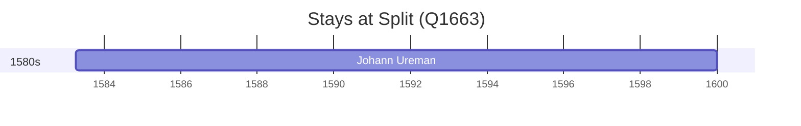

# Split (Q1663)

*city in Split-Dalmatia County, Croatia*

Wikidata: [Q1663](https://www.wikidata.org/wiki/Q1663)

1 occurrence(s) across 1 transcribed value(s), 1 person(s).

**Transcribed variants:**

- `Split, Croácia` (1×, 1583–1583)

| Date | Variant | Person | Type | Entity id | Real entity |
|------|---------|--------|------|-----------|-------------|
| 1583-04-06 | Split, Croácia | Johann Ureman | nascimento | [deh-johann-ureman](deh-johann-ureman) | — |

