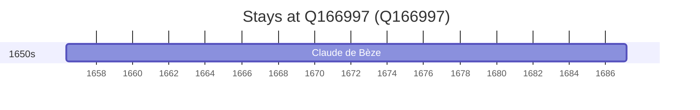

# Q166997

*(fetch error: HTTP Error 429: Too Many Requests)*

Wikidata: [Q166997](https://www.wikidata.org/wiki/Q166997)

1 occurrence(s) across 1 transcribed value(s), 1 person(s).

**Transcribed variants:**

- `Nevers (paróquia de St-Jean)` (1×, 1656–1656)

| Date | Variant | Person | Type | Entity id | Real entity |
|------|---------|--------|------|-----------|-------------|
| 1656-05-08 | Nevers (paróquia de St-Jean) | Claude de Bèze | nascimento | [deh-claude-de-beze](deh-claude-de-beze) | — |

