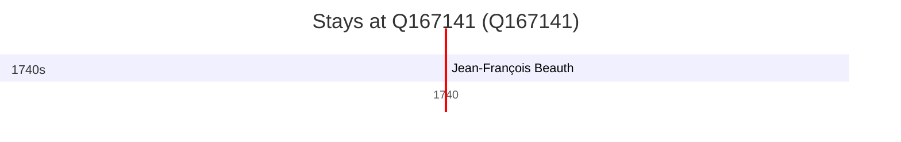

# Q167141

*(fetch error: HTTP Error 429: Too Many Requests)*

Wikidata: [Q167141](https://www.wikidata.org/wiki/Q167141)

1 occurrence(s) across 1 transcribed value(s), 1 person(s).

**Transcribed variants:**

- `Laon` (1×, 1740–1740)

| Date | Variant | Person | Type | Entity id | Real entity |
|------|---------|--------|------|-----------|-------------|
| 1740 | Laon | Jean-François Beauth | jesuita-ordenacao-padre | [deh-jean-francois-beauth](deh-jean-francois-beauth) | — |

