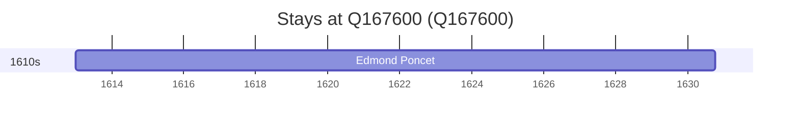

# Q167600

*(fetch error: HTTP Error 429: Too Many Requests)*

Wikidata: [Q167600](https://www.wikidata.org/wiki/Q167600)

1 occurrence(s) across 1 transcribed value(s), 1 person(s).

**Transcribed variants:**

- `Auxerre` (1×, 1613–1613)

| Date | Variant | Person | Type | Entity id | Real entity |
|------|---------|--------|------|-----------|-------------|
| 1613 | Auxerre | Edmond Poncet | nascimento | [deh-edmond-poncet](deh-edmond-poncet) | — |

