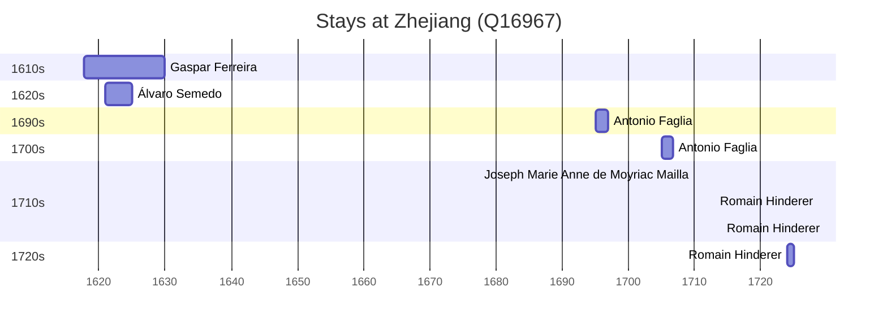

# Zhejiang (Q16967)

*province of China*

Wikidata: [Q16967](https://www.wikidata.org/wiki/Q16967)

8 occurrence(s) across 2 transcribed value(s), 5 person(s).

**Transcribed variants:**

- `Tchö-kiang` (4×, 1617–1617)
- `Chekiang` (4×, 1710–1724)

| Date | Variant | Person | Type | Entity id | Real entity |
|------|---------|--------|------|-----------|-------------|
| 1617-10-02 | Tchö-kiang | Gaspar Ferreira | estadia | [deh-gaspar-ferreira](deh-gaspar-ferreira) | — |
| 1710 | Chekiang | Joseph Marie Anne de Moyriac Mailla | estadia | [deh-joseph-marie-anne-de-moyriac-mailla](deh-joseph-marie-anne-de-moyriac-mailla) | — |
| 1713 | Chekiang | Romain Hinderer | estadia | [deh-romain-hinderer](deh-romain-hinderer) | — |
| 1714 | Chekiang | Romain Hinderer | estadia | [deh-romain-hinderer](deh-romain-hinderer) | — |
| 1724 | Chekiang | Romain Hinderer | estadia | [deh-romain-hinderer](deh-romain-hinderer) | — |
| >1621 | Tchö-kiang | Álvaro Semedo | estadia | [deh-alvaro-semedo](deh-alvaro-semedo) | — |
| >1695 | Tchö-kiang | Antonio Faglia | estadia | [deh-antonio-faglia](deh-antonio-faglia) | — |
| >1705 | Tchö-kiang | Antonio Faglia | estadia | [deh-antonio-faglia](deh-antonio-faglia) | — |

### Co-presence

These persons were plausibly at this place during overlapping periods (interval estimation from stay dates; rough — see method note below).

| Period | Persons |
|--------|---------|
| 1620s | [Gaspar Ferreira](deh-gaspar-ferreira), [Álvaro Semedo](deh-alvaro-semedo) |

*1 overlapping pair(s) involving 2 person(s). Method: interval start = stay event date; end = next embarque/partida/different-place event, or death, or +15yr cap.*

