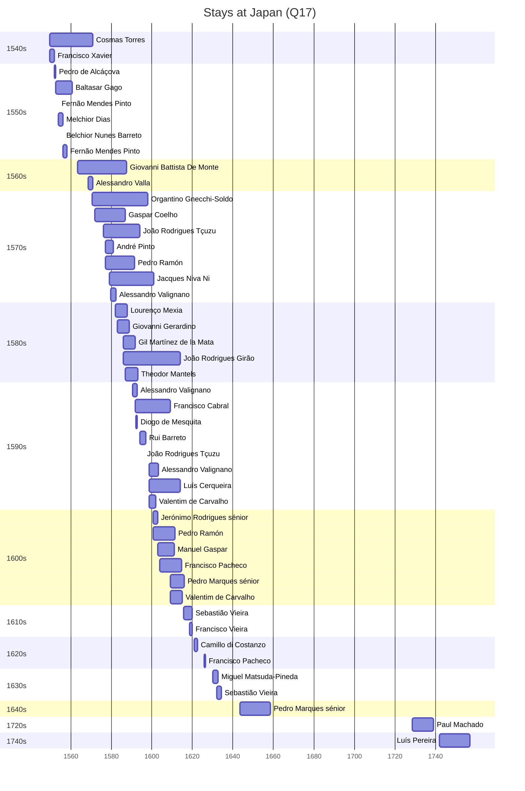

# Japan (Q17)

*island country in East Asia*

Wikidata: [Q17](https://www.wikidata.org/wiki/Q17)

73 occurrence(s) across 3 transcribed value(s), 43 person(s).

**Transcribed variants:**

- `Japão` (71×, 1549–1739)
- `Japão (província)` (1×, 1728–1728)
- `província do Japão` (1×, 1742–1742)

| Date | Variant | Person | Type | Entity id | Real entity |
|------|---------|--------|------|-----------|-------------|
| 1549-08-15 | Japão | Cosmas Torres | chegada | [deh-cosmas-torres](deh-cosmas-torres) | — |
| 1549-08-15 | Japão | Francisco Xavier | estadia | [deh-francisco-xavier](deh-francisco-xavier) | — |
| 1551-11-15 | Japão | Francisco Xavier | estadia | [deh-francisco-xavier](deh-francisco-xavier) | — |
| 1552 | Japão | Pedro de Alcáçova | estadia | [deh-pedro-de-alcacova](deh-pedro-de-alcacova) | — |
| 1552-09-07 | Japão | Baltasar Gago | estadia | [deh-baltasar-gago](deh-baltasar-gago) | — |
| 1554 | Japão | Fernão Mendes Pinto | estadia | [deh-fernao-mendes-pinto](deh-fernao-mendes-pinto) | — |
| 1554 | Japão | Melchior Dias | estadia | [deh-melchor-diaz-ref1](deh-melchor-diaz-ref1) | — |
| 1556 | Japão | Belchior Nunes Barreto | chegada | [deh-belchior-nunes-barreto](deh-belchior-nunes-barreto) | [rp606650](rp606650) |
| 1556 | Japão | Fernão Mendes Pinto | estadia | [deh-fernao-mendes-pinto](deh-fernao-mendes-pinto) | — |
| 1556 | Japão | Melchior Dias | estadia | [deh-melchor-diaz-ref1](deh-melchor-diaz-ref1) | — |
| 1560 | Japão | Baltasar Gago | estadia | [deh-baltasar-gago](deh-baltasar-gago) | — |
| 1563-07-06 | Japão | Giovanni Battista De Monte | estadia | [deh-giovanni-battista-de-monte](deh-giovanni-battista-de-monte) | — |
| 1568-06-28 | Japão | Alessandro Valla | estadia | [deh-alessandro-valla](deh-alessandro-valla) | — |
| 1570-06-18 | Japão | Francisco Cabral | partida | [deh-francisco-cabral](deh-francisco-cabral) | [rp400649](rp400649) |
| 1570-06-18 | Japão | Organtino Gnecchi-Soldo | chegada | [deh-organtino-gnecchi-soldo](deh-organtino-gnecchi-soldo) | — |
| 1571 | Japão | Gaspar Coelho | partida | [deh-gaspar-coelho](deh-gaspar-coelho) | — |
| 1572 | Japão | Gaspar Coelho | chegada | [deh-gaspar-coelho](deh-gaspar-coelho) | — |
| 1573-06-17 | Japão | Gonçalo Álvares | partida | [deh-goncalo-alvares](deh-goncalo-alvares) | [rp127859](rp127859) |
| 1576 | Japão | João Rodrigues Tçuzu | chegada | [deh-joao-rodrigues-tcuzu](deh-joao-rodrigues-tcuzu) | — |
| 1577 | Japão | Pedro Ramón | estadia | [deh-pedro-ramon](deh-pedro-ramon) | — |
| 1577 | Japão | André Pinto | estadia | [deh-andre-pinto](deh-andre-pinto) | — |
| 1579 | Japão | Jacques Niva Ni | nascimento | [deh-jacques-niva-ni](deh-jacques-niva-ni) | — |
| 1579-07-07 | Japão | Alessandro Valignano | partida | [deh-alessandro-valignano](deh-alessandro-valignano) | — |
| 1579-07-07 | Japão | Lourenço Mexia | partida | [deh-lourenco-mexia](deh-lourenco-mexia) | — |
| 1579-07-25 | Japão | Alessandro Valignano | chegada | [deh-alessandro-valignano](deh-alessandro-valignano) | — |
| 1580-12 | Japão | João Rodrigues Tçuzu | jesuita-entrada | [deh-joao-rodrigues-tcuzu](deh-joao-rodrigues-tcuzu) | — |
| 1582-02-20 | Japão | Lourenço Mexia | estadia | [deh-lourenco-mexia](deh-lourenco-mexia) | — |
| 1582-07-06 | Japão | Alonso Sanchéz | partida | [deh-alonso-sanchez](deh-alonso-sanchez) | — |
| 1583 | Japão | Giovanni Gerardino | estadia | [deh-giovanni-gerardino](deh-giovanni-gerardino) | — |
| 1586 | Japão | João Rodrigues Girão | chegada | [deh-joao-rodrigues-girao](deh-joao-rodrigues-girao) | — |
| 1586 | Japão | Gil Martínez de la Mata | chegada | [deh-gil-martinez-de-la-mata](deh-gil-martinez-de-la-mata) | — |
| 1587 | Japão | Theodor Mantels | estadia | [deh-theodor-mantels](deh-theodor-mantels) | — |
| 1587-07-24 | Japão | Gaspar Coelho | estadia | [deh-gaspar-coelho](deh-gaspar-coelho) | — |
| 1589 | Japão | Giovanni Gerardino | estadia | [deh-giovanni-gerardino](deh-giovanni-gerardino) | — |
| 1590-06-23 | Japão | Alessandro Valignano | partida | [deh-alessandro-valignano](deh-alessandro-valignano) | — |
| 1590-07-21 | Japão | Alessandro Valignano | estadia | [deh-alessandro-valignano](deh-alessandro-valignano) | — |
| 1591-10-08 | Japão | Francisco Cabral | estadia | [deh-francisco-cabral](deh-francisco-cabral) | [rp400649](rp400649) |
| 1592 | Japão | Diogo de Mesquita | estadia | [deh-diogo-de-mesquita](deh-diogo-de-mesquita) | — |
| 1592-10-09 | Japão | Alessandro Valignano | estadia | [deh-alessandro-valignano](deh-alessandro-valignano) | — |
| 1594 | Japão | Rui Barreto | estadia | [deh-rui-barreto](deh-rui-barreto) | — |
| 1596 | Japão | João Rodrigues Tçuzu | estadia | [deh-joao-rodrigues-tcuzu](deh-joao-rodrigues-tcuzu) | — |
| 1598-08-05 | Japão | Alessandro Valignano | estadia | [deh-alessandro-valignano](deh-alessandro-valignano) | — |
| 1598-08-05 | Japão | Luís Cerqueira | chegada | [deh-luis-cerqueira](deh-luis-cerqueira) | — |
| 1598-08-05 | Japão | Valentim de Carvalho | estadia | [deh-valentim-de-carvalho](deh-valentim-de-carvalho) | — |
| 1600-02-01 | Japão | Pedro Gómez | morte | [deh-pedro-gomez](deh-pedro-gomez) | — |
| 1600-08-13 | Japão | Jerónimo Rodrigues, sénior | chegada | [deh-jeronimo-rodrigues-senior](deh-jeronimo-rodrigues-senior) | — |
| 1600-08-13 | Japão | Pedro Ramón | estadia | [deh-pedro-ramon](deh-pedro-ramon) | — |
| 1603-01-15 | Japão | Alessandro Valignano | estadia | [deh-alessandro-valignano](deh-alessandro-valignano) | — |
| 1603-01-15 | Japão | Manuel Gaspar | estadia | [deh-manuel-gaspar](deh-manuel-gaspar) | — |
| 1604 | Japão | Francisco Pacheco | estadia | [deh-francisco-pacheco](deh-francisco-pacheco) | — |
| 1608 | Japão | Francisco Pacheco | estadia | [deh-francisco-pacheco](deh-francisco-pacheco) | — |
| 1609 | Japão | Valentim de Carvalho | estadia | [deh-valentim-de-carvalho](deh-valentim-de-carvalho) | — |
| 1609 | Japão | Pedro Marques, sénior | estadia | [deh-pedro-marques-senior](deh-pedro-marques-senior) | — |
| 1610-07 | Japão | Diogo Antunes | morte | [deh-diogo-antunes](deh-diogo-antunes) | — |
| 1612-08 | Japão | Francisco Pacheco | estadia | [deh-francisco-pacheco](deh-francisco-pacheco) | — |
| 1614 | Japão | Pedro Marques, sénior | estadia | [deh-pedro-marques-senior](deh-pedro-marques-senior) | — |
| 1614-11 | Japão | Valentim de Carvalho | estadia | [deh-valentim-de-carvalho](deh-valentim-de-carvalho) | — |
| 1615-08 | Japão | Francisco Pacheco | partida | [deh-francisco-pacheco](deh-francisco-pacheco) | — |
| 1615-08 | Japão | Sebastião Vieira | chegada | [deh-sebastiao-vieira](deh-sebastiao-vieira) | — |
| 1618-08 | Japão | Francisco Vieira | estadia | [deh-francisco-vieira](deh-francisco-vieira) | — |
| 1619-10-26 | Japão | Francisco Vieira | estadia | [deh-francisco-vieira](deh-francisco-vieira) | — |
| 1621 | Japão | Camillo di Costanzo | estadia | [deh-camillo-di-costanzo](deh-camillo-di-costanzo) | — |
| 1625-12-17 | Japão | Francisco Pacheco | estadia | [deh-francisco-pacheco](deh-francisco-pacheco) | — |
| 1630 | Japão | Miguel Matsuda-Pineda | estadia | [deh-miguel-matsuda-pineda](deh-miguel-matsuda-pineda) | — |
| 1631 | Japão | Miguel Matsuda-Pineda | estadia | [deh-miguel-matsuda-pineda](deh-miguel-matsuda-pineda) | — |
| 1632 | Japão | Sebastião Vieira | chegada | [deh-sebastiao-vieira](deh-sebastiao-vieira) | — |
| 1632-07-12 | Japão | Mateus de Couros | morte | [deh-mateus-de-couros](deh-mateus-de-couros) | — |
| 1643-06-08 | Japão | Pedro Marques, sénior | partida | [deh-pedro-marques-senior](deh-pedro-marques-senior) | — |
| 1643-08 | Japão | Pedro Marques, sénior | chegada | [deh-pedro-marques-senior](deh-pedro-marques-senior) | — |
| 1680-12 | Japão | Antoine Thomas | partida | [deh-antoine-thomas](deh-antoine-thomas) | [rp486350](rp486350) |
| 1728-05-23 | Japão (província) | Paul Machado | jesuita-entrada | [deh-paul-machado](deh-paul-machado) | — |
| 1739-04-25 | Japão | Francisco Moreira | morte | [deh-francisco-moreira](deh-francisco-moreira) | — |
| 1742 | província do Japão | Luís Pereira | estadia | [deh-luis-pereira](deh-luis-pereira) | — |

### Co-presence

These persons were plausibly at this place during overlapping periods (interval estimation from stay dates; rough — see method note below).

| Period | Persons |
|--------|---------|
| 1540s | [Cosmas Torres](deh-cosmas-torres), [Francisco Xavier](deh-francisco-xavier) |
| 1550s | [Baltasar Gago](deh-baltasar-gago), [Belchior Nunes Barreto](rp606650), [Cosmas Torres](deh-cosmas-torres), [Fernão Mendes Pinto](deh-fernao-mendes-pinto), [Francisco Xavier](deh-francisco-xavier), [Melchior Dias](deh-melchor-diaz-ref1), [Pedro de Alcáçova](deh-pedro-de-alcacova) |
| 1560s | [Alessandro Valla](deh-alessandro-valla), [Cosmas Torres](deh-cosmas-torres), [Giovanni Battista De Monte](deh-giovanni-battista-de-monte) |
| 1570s | [Alessandro Valignano](deh-alessandro-valignano), [Alessandro Valla](deh-alessandro-valla), [André Pinto](deh-andre-pinto), [Cosmas Torres](deh-cosmas-torres), [Giovanni Battista De Monte](deh-giovanni-battista-de-monte), [Jacques Niva Ni](deh-jacques-niva-ni), [João Rodrigues Tçuzu](deh-joao-rodrigues-tcuzu), [Organtino Gnecchi-Soldo](deh-organtino-gnecchi-soldo), [Pedro Ramón](deh-pedro-ramon) |
| 1580s | [Alessandro Valignano](deh-alessandro-valignano), [Gil Martínez de la Mata](deh-gil-martinez-de-la-mata), [Giovanni Battista De Monte](deh-giovanni-battista-de-monte), [Giovanni Gerardino](deh-giovanni-gerardino), [Jacques Niva Ni](deh-jacques-niva-ni), [João Rodrigues Girão](deh-joao-rodrigues-girao), [João Rodrigues Tçuzu](deh-joao-rodrigues-tcuzu), [Lourenço Mexia](deh-lourenco-mexia), [Organtino Gnecchi-Soldo](deh-organtino-gnecchi-soldo), [Pedro Ramón](deh-pedro-ramon), [Theodor Mantels](deh-theodor-mantels) |
| 1590s | [Alessandro Valignano](deh-alessandro-valignano), [Diogo de Mesquita](deh-diogo-de-mesquita), [Francisco Cabral](rp400649), [Gil Martínez de la Mata](deh-gil-martinez-de-la-mata), [Jacques Niva Ni](deh-jacques-niva-ni), [João Rodrigues Girão](deh-joao-rodrigues-girao), [João Rodrigues Tçuzu](deh-joao-rodrigues-tcuzu), [Luís Cerqueira](deh-luis-cerqueira), [Organtino Gnecchi-Soldo](deh-organtino-gnecchi-soldo), [Pedro Ramón](deh-pedro-ramon), [Rui Barreto](deh-rui-barreto), [Theodor Mantels](deh-theodor-mantels), [Valentim de Carvalho](deh-valentim-de-carvalho) |
| 1600s | [Alessandro Valignano](deh-alessandro-valignano), [Francisco Cabral](rp400649), [Francisco Pacheco](deh-francisco-pacheco), [Jacques Niva Ni](deh-jacques-niva-ni), [Jerónimo Rodrigues, sénior](deh-jeronimo-rodrigues-senior), [João Rodrigues Girão](deh-joao-rodrigues-girao), [Luís Cerqueira](deh-luis-cerqueira), [Manuel Gaspar](deh-manuel-gaspar), [Pedro Marques, sénior](deh-pedro-marques-senior), [Pedro Ramón](deh-pedro-ramon), [Valentim de Carvalho](deh-valentim-de-carvalho) |
| 1610s | [Francisco Vieira](deh-francisco-vieira), [Pedro Marques, sénior](deh-pedro-marques-senior), [Sebastião Vieira](deh-sebastiao-vieira) |
| 1630s | [Miguel Matsuda-Pineda](deh-miguel-matsuda-pineda), [Sebastião Vieira](deh-sebastiao-vieira) |

*155 overlapping pair(s) involving 32 person(s). Method: interval start = stay event date; end = next embarque/partida/different-place event, or death, or +15yr cap.*

