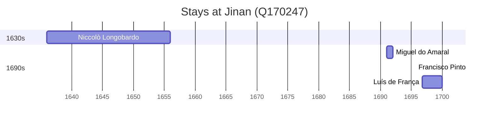

# Jinan (Q170247)

*capital of Shandong province, China*

Wikidata: [Q170247](https://www.wikidata.org/wiki/Q170247)

7 occurrence(s) across 4 transcribed value(s), 6 person(s).

**Transcribed variants:**

- `Tsinan fou, Shangtung` (1×, 1636–1636)
- `Tsinan fou` (2×, 1645–1660)
- `Tsinan fou, Shantung` (3×, 1691–1722)
- `«Cinanfu» (Tsinan), Shangtung` (1×, 1695–1695)

| Date | Variant | Person | Type | Entity id | Real entity |
|------|---------|--------|------|-----------|-------------|
| 1636 | Tsinan fou, Shangtung | Niccolò Longobardo | estadia | [deh-niccolo-longobardo](deh-niccolo-longobardo) | — |
| 1645 | Tsinan fou | Niccolò Longobardo | estadia | [deh-niccolo-longobardo](deh-niccolo-longobardo) | — |
| 1660-09-17 | Tsinan fou | Bernhard Diestel | morte | [deh-bernhard-diestel](deh-bernhard-diestel) | — |
| 1691 | Tsinan fou, Shantung | Miguel do Amaral | estadia | [deh-miguel-do-amaral](deh-miguel-do-amaral) | [rp086368](rp086368) |
| 1695-08-15 | «Cinanfu» (Tsinan), Shangtung | Francisco Pinto | jesuita-votos-local | [deh-francisco-pinto-i](deh-francisco-pinto-i) | — |
| 1696-10-13 | Tsinan fou, Shantung | Luís de França | estadia | [deh-luis-de-franca](deh-luis-de-franca) | — |
| 1722-11-26 | Tsinan fou, Shantung | Giacomo Filippo Simonelli | partida | [deh-giacomo-filippo-simonelli](deh-giacomo-filippo-simonelli) | — |

