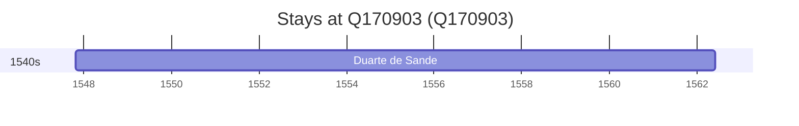

# Q170903

*(fetch error: HTTP Error 429: Too Many Requests)*

Wikidata: [Q170903](https://www.wikidata.org/wiki/Q170903)

1 occurrence(s) across 1 transcribed value(s), 1 person(s).

**Transcribed variants:**

- `Guimarães` (1×, 1547–1547)

| Date | Variant | Person | Type | Entity id | Real entity |
|------|---------|--------|------|-----------|-------------|
| 1547-10-25 | Guimarães | Duarte de Sande | nascimento | [deh-duarte-de-sande](deh-duarte-de-sande) | — |

