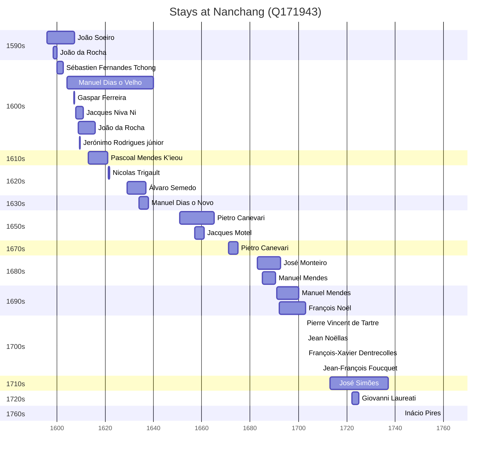

# Nanchang (Q171943)

*capital of Jiangxi province, China*

Wikidata: [Q171943](https://www.wikidata.org/wiki/Q171943)

43 occurrence(s) across 17 transcribed value(s), 29 person(s).

**Transcribed variants:**

- `Nanchang (Nan-tch'ang fou)` (6×, 1595–1661)
- `Nan-tch'ang` (3×, 1596–1702)
- `Nan-tch'ang fou` (6×, 1596–1616)
- `Nanchang` (8×, 1600–1713)
- `Nanchang (Nan-tch'ang)` (3×, 1607–1691)
- `Nanchang fou, Kiang-si` (1×, 1629–1629)
- `Nanchang fou, Kiangsi` (1×, 1634–1634)
- `Nan-tch'anf gou, Kiang-si` (1×, 1657–1657)
- `Nanchang, Kiang-si` (1×, 1657–1657)
- `Nanchang fou` (2×, 1671–1702)
- `Nanchang, Jiangxi` (2×, 1683–1684)
- `Nan-tch'ang, Kiangsi` (2×, 1692–1700)
- `Kiangsi, Nanchang` (1×, 1703–1703)
- `Nan-tch'ang fou, Kiangsi` (2×, 1722–1725)
- `Nancham, Kiangsi` (1×, 1760–1760)
- `Nanchang (Nantch'ang, Kiangsi)` (2×, undated)
- `Nanchang, Kigansi` (1×, undated)

| Date | Variant | Person | Type | Entity id | Real entity |
|------|---------|--------|------|-----------|-------------|
| — | Nanchang (Nantch'ang, Kiangsi) | Sébastien Fernandes Tchong | estadia | [deh-sebastien-fernandes-tchong](deh-sebastien-fernandes-tchong) | — |
| — | Nanchang (Nantch'ang, Kiangsi) | Matteo Ricci | estadia | [deh-sebastien-fernandes-tchong-ref2](deh-sebastien-fernandes-tchong-ref2) | [rp302155](rp302155) |
| 1595-12-24 | Nanchang (Nan-tch'ang fou) | João Soeiro | estadia | [deh-joao-soeiro](deh-joao-soeiro) | — |
| 1596-01-01 | Nan-tch'ang | Matteo Ricci | jesuita-votos-local | [deh-matteo-ricci](deh-matteo-ricci) | [rp302155](rp302155) |
| 1596-06-28 | Nan-tch'ang fou | Matteo Ricci | estadia | [deh-matteo-ricci](deh-matteo-ricci) | [rp302155](rp302155) |
| 1598-06-23 | Nan-tch'ang fou | João da Rocha | estadia | [deh-joao-da-rocha](deh-joao-da-rocha) | — |
| 1598-06-25 | Nan-tch'ang fou | Matteo Ricci | estadia | [deh-matteo-ricci](deh-matteo-ricci) | [rp302155](rp302155) |
| 1600 | Nanchang | Sébastien Fernandes Tchong | estadia | [deh-sebastien-fernandes-tchong](deh-sebastien-fernandes-tchong) | — |
| 1602-09-20 | Nanchang | Sébastien Fernandes Tchong | partida | [deh-sebastien-fernandes-tchong](deh-sebastien-fernandes-tchong) | — |
| 1604 | Nanchang (Nan-tch'ang fou) | João Soeiro | estadia | [deh-joao-soeiro](deh-joao-soeiro) | — |
| 1604-03 | Nanchang | Manuel Dias, o Velho | estadia | [deh-manuel-dias-o-velho](deh-manuel-dias-o-velho) | — |
| 1606 | Nanchang | Sabatino De Ursis | partida | [deh-sabatino-de-ursis](deh-sabatino-de-ursis) | — |
| 1607 | Nanchang (Nan-tch'ang) | Gaspar Ferreira | estadia | [deh-gaspar-ferreira](deh-gaspar-ferreira) | — |
| 1608 | Nan-tch'ang | Jacques Niva Ni | jesuita-entrada | [deh-jacques-niva-ni](deh-jacques-niva-ni) | — |
| 1609 | Nan-tch'ang fou | João da Rocha | estadia | [deh-joao-da-rocha](deh-joao-da-rocha) | — |
| 1609-05-15 | Nan-tch'ang fou | Jerónimo Rodrigues, júnior | estadia | [deh-jeronimo-rodrigues-junior](deh-jeronimo-rodrigues-junior) | — |
| 1613 | Nanchang | Pascoal Mendes K'ieou | estadia | [deh-pascoal-mendes-kieou](deh-pascoal-mendes-kieou) | — |
| 1616 | Nan-tch'ang fou | João da Rocha | estadia | [deh-joao-da-rocha](deh-joao-da-rocha) | — |
| 1620-12 | Nanchang (Nan-tch'ang fou) | Johann Ureman | partida | [deh-johann-ureman](deh-johann-ureman) | — |
| 1621-04 | Nanchang (Nan-tch'ang fou) | Johann Ureman | morte | [deh-johann-ureman](deh-johann-ureman) | — |
| 1621-05 | Nanchang (Nan-tch'ang fou) | Nicolas Trigault | estadia | [deh-nicolas-trigault](deh-nicolas-trigault) | — |
| 1629 | Nanchang fou, Kiang-si | Álvaro Semedo | estadia | [deh-alvaro-semedo](deh-alvaro-semedo) | — |
| 1634 | Nanchang fou, Kiangsi | Manuel Dias, o Novo | estadia | [deh-manuel-dias-o-novo](deh-manuel-dias-o-novo) | — |
| 1657 | Nanchang, Kiang-si | Jacques Motel | estadia | [deh-jacques-motel](deh-jacques-motel) | — |
| 1657-01 | Nan-tch'anf gou, Kiang-si | Nicolas Motel | morte | [deh-nicolas-motel](deh-nicolas-motel) | — |
| 1661-11-22 | Nanchang (Nan-tch'ang fou) | Louis Gobet | morte | [deh-louis-gobet](deh-louis-gobet) | — |
| 1671 | Nanchang fou | Pietro Canevari | estadia | [deh-pietro-canevari](deh-pietro-canevari) | — |
| 1675 | Nanchang | Pietro Canevari | morte | [deh-pietro-canevari](deh-pietro-canevari) | — |
| 1683 | Nanchang, Jiangxi | José Monteiro | estadia | [deh-jose-monteiro](deh-jose-monteiro) | — |
| 1684 | Nanchang, Jiangxi | José Monteiro | estadia | [deh-jose-monteiro](deh-jose-monteiro) | — |
| 1685 | Nanchang (Nan-tch'ang) | Manuel Mendes | estadia | [deh-manuel-mendes](deh-manuel-mendes) | [rp352197](rp352197) |
| 1691 | Nanchang (Nan-tch'ang) | Manuel Mendes | estadia | [deh-manuel-mendes](deh-manuel-mendes) | [rp352197](rp352197) |
| 1692 | Nan-tch'ang, Kiangsi | François Noël | estadia | [deh-francois-noel](deh-francois-noel) | — |
| 1700 | Nan-tch'ang, Kiangsi | François Noël | estadia | [deh-francois-noel](deh-francois-noel) | — |
| 1702-02-20 | Nanchang fou | Pierre Vincent de Tartre | jesuita-votos-local | [deh-pierre-vincent-de-tartre](deh-pierre-vincent-de-tartre) | — |
| 1702-08-15 | Nan-tch'ang | Jean Noëllas | jesuita-votos-local | [deh-jean-noellas](deh-jean-noellas) | — |
| 1703 | Kiangsi, Nanchang | François-Xavier Dentrecolles | estadia | [deh-francois-xavier-dentrecolles](deh-francois-xavier-dentrecolles) | — |
| 1709 | Nanchang | Jean-François Foucquet | estadia | [deh-jean-francois-foucquet](deh-jean-francois-foucquet) | — |
| 1713 | Nanchang | José Simões | estadia | [deh-jose-simoes](deh-jose-simoes) | — |
| 1722 | Nan-tch'ang fou, Kiangsi | Giovanni Laureati | estadia | [deh-giovanni-laureati](deh-giovanni-laureati) | [rp323905](rp323905) |
| 1725 | Nan-tch'ang fou, Kiangsi | Giovanni Laureati | estadia | [deh-giovanni-laureati](deh-giovanni-laureati) | [rp323905](rp323905) |
| 1760-03-02 | Nancham, Kiangsi | Inácio Pires | jesuita-votos-local | [deh-inacio-pires](deh-inacio-pires) | — |
| >1651:<1665-06-28 | Nanchang, Kigansi | Pietro Canevari | estadia | [deh-pietro-canevari](deh-pietro-canevari) | — |

### Co-presence

These persons were plausibly at this place during overlapping periods (interval estimation from stay dates; rough — see method note below).

| Period | Persons |
|--------|---------|
| 1590s | [João Soeiro](deh-joao-soeiro), [João da Rocha](deh-joao-da-rocha) |
| 1600s | [Gaspar Ferreira](deh-gaspar-ferreira), [Jacques Niva Ni](deh-jacques-niva-ni), [Jerónimo Rodrigues, júnior](deh-jeronimo-rodrigues-junior), [João Soeiro](deh-joao-soeiro), [João da Rocha](deh-joao-da-rocha), [Manuel Dias, o Velho](deh-manuel-dias-o-velho), [Sébastien Fernandes Tchong](deh-sebastien-fernandes-tchong) |
| 1610s | [João da Rocha](deh-joao-da-rocha), [Manuel Dias, o Velho](deh-manuel-dias-o-velho), [Pascoal Mendes K'ieou](deh-pascoal-mendes-kieou) |
| 1620s | [Manuel Dias, o Velho](deh-manuel-dias-o-velho), [Nicolas Trigault](deh-nicolas-trigault), [Álvaro Semedo](deh-alvaro-semedo) |
| 1630s | [Manuel Dias, o Novo](deh-manuel-dias-o-novo), [Manuel Dias, o Velho](deh-manuel-dias-o-velho), [Álvaro Semedo](deh-alvaro-semedo) |
| 1650s | [Jacques Motel](deh-jacques-motel), [Pietro Canevari](deh-pietro-canevari) |
| 1680s | [José Monteiro](deh-jose-monteiro), [Manuel Mendes](rp352197) |
| 1690s | [François Noël](deh-francois-noel), [José Monteiro](deh-jose-monteiro), [Manuel Mendes](rp352197) |
| 1700s | [François Noël](deh-francois-noel), [Jean Noëllas](deh-jean-noellas), [Pierre Vincent de Tartre](deh-pierre-vincent-de-tartre) |
| 1720s | [Giovanni Laureati](rp323905), [José Simões](deh-jose-simoes) |

*25 overlapping pair(s) involving 20 person(s). Method: interval start = stay event date; end = next embarque/partida/different-place event, or death, or +15yr cap.*

