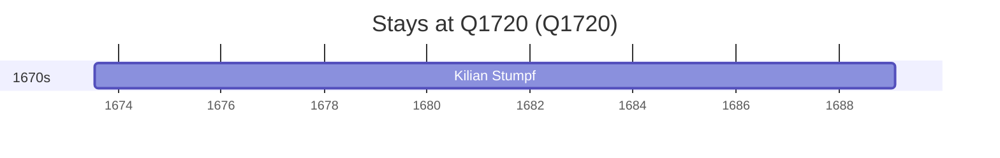

# Q1720

*(fetch error: HTTP Error 429: Too Many Requests)*

Wikidata: [Q1720](https://www.wikidata.org/wiki/Q1720)

1 occurrence(s) across 1 transcribed value(s), 1 person(s).

**Transcribed variants:**

- `Mainz` (1×, 1673–1673)

| Date | Variant | Person | Type | Entity id | Real entity |
|------|---------|--------|------|-----------|-------------|
| 1673-07-17 | Mainz | Kilian Stumpf | jesuita-entrada | [deh-kilian-stumpf](deh-kilian-stumpf) | — |

