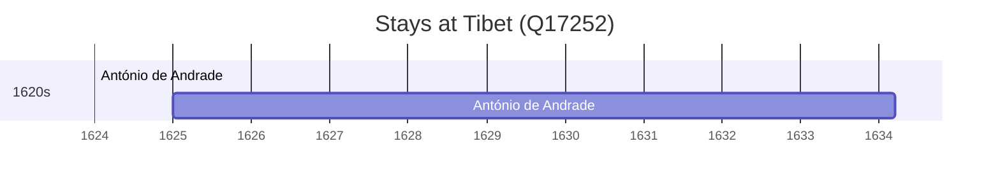

# Tibet (Q17252)

*plateau region in west China*

Wikidata: [Q17252](https://www.wikidata.org/wiki/Q17252)

2 occurrence(s) across 1 transcribed value(s), 1 person(s).

**Transcribed variants:**

- `Tibete` (2×, 1624–1625)

| Date | Variant | Person | Type | Entity id | Real entity |
|------|---------|--------|------|-----------|-------------|
| 1624 | Tibete | António de Andrade | estadia | [deh-antonio-de-andrade](deh-antonio-de-andrade) | — |
| 1625 | Tibete | António de Andrade | estadia | [deh-antonio-de-andrade](deh-antonio-de-andrade) | — |

