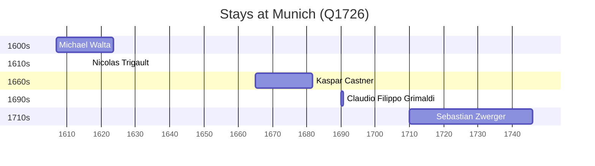

# Munich (Q1726)

*capital and most populous city of Bavaria, Germany*

Wikidata: [Q1726](https://www.wikidata.org/wiki/Q1726)

5 occurrence(s) across 1 transcribed value(s), 5 person(s).

**Transcribed variants:**

- `Munique` (5×, 1606–1710)

| Date | Variant | Person | Type | Entity id | Real entity |
|------|---------|--------|------|-----------|-------------|
| 1606-11-19 | Munique | Michael Walta | nascimento | [deh-michael-walta](deh-michael-walta) | — |
| 1665-02-07 | Munique | Kaspar Castner | nascimento | [deh-kaspar-castner](deh-kaspar-castner) | — |
| 1690-02-04 | Munique | Claudio Filippo Grimaldi | estadia | [deh-claudio-filippo-grimaldi](deh-claudio-filippo-grimaldi) | — |
| 1710-01-17 | Munique | Sebastian Zwerger | nascimento | [deh-sebastian-zwerger](deh-sebastian-zwerger) | — |
| >1616-05 | Munique | Nicolas Trigault | estadia | [deh-nicolas-trigault](deh-nicolas-trigault) | — |

### Co-presence

These persons were plausibly at this place during overlapping periods (interval estimation from stay dates; rough — see method note below).

| Period | Persons |
|--------|---------|
| 1610s | [Michael Walta](deh-michael-walta), [Nicolas Trigault](deh-nicolas-trigault) |

*1 overlapping pair(s) involving 2 person(s). Method: interval start = stay event date; end = next embarque/partida/different-place event, or death, or +15yr cap.*

