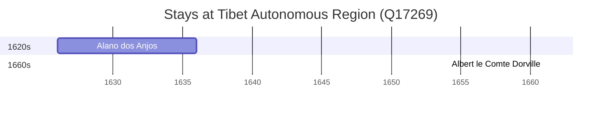

# Tibet Autonomous Region (Q17269)

*autonomous region of China*

Wikidata: [Q17269](https://www.wikidata.org/wiki/Q17269)

3 occurrence(s) across 1 transcribed value(s), 3 person(s).

**Transcribed variants:**

- `Tibete` (3×, 1626–1626)

| Date | Variant | Person | Type | Entity id | Real entity |
|------|---------|--------|------|-----------|-------------|
| — | Tibete | Luís da Gama | estadia | [deh-luis-da-gama](deh-luis-da-gama) | — |
| 1626 | Tibete | Alano dos Anjos | chegada | [deh-alano-dos-anjos](deh-alano-dos-anjos) | — |
| >1661 | Tibete | Albert le Comte Dorville | estadia | [deh-albert-le-comte-dorville](deh-albert-le-comte-dorville) | — |

