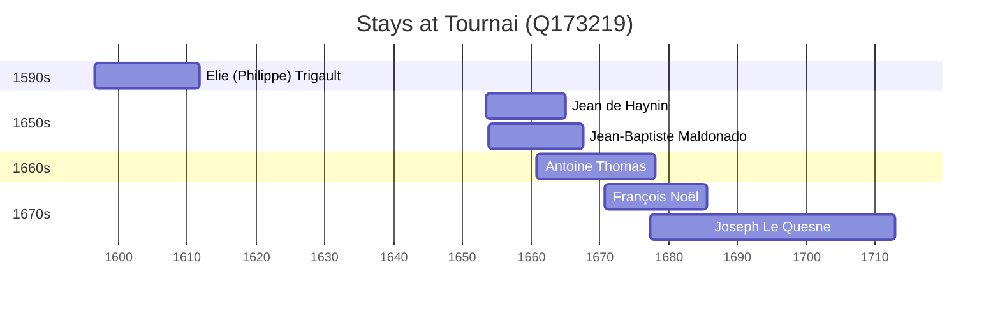

# Tournai (Q173219)

*city in Wallonia, Belgium*

Wikidata: [Q173219](https://www.wikidata.org/wiki/Q173219)

7 occurrence(s) across 1 transcribed value(s), 6 person(s).

**Transcribed variants:**

- `Tournai` (7×, 1596–1695)

| Date | Variant | Person | Type | Entity id | Real entity |
|------|---------|--------|------|-----------|-------------|
| 1596-07-05 | Tournai | Elie (Philippe) Trigault | jesuita-entrada | [deh-eli-philippe-trigault](deh-eli-philippe-trigault) | — |
| 1653-06-09 | Tournai | Jean de Haynin | jesuita-entrada | [deh-jean-de-haynin](deh-jean-de-haynin) | — |
| 1653-09-29 | Tournai | Jean-Baptiste Maldonado | jesuita-entrada | [deh-jean-baptiste-maldonado](deh-jean-baptiste-maldonado) | — |
| 1660-09-24 | Tournai | Antoine Thomas | jesuita-entrada | [deh-antoine-thomas](deh-antoine-thomas) | [rp486350](rp486350) |
| 1670-09-30 | Tournai | François Noël | jesuita-entrada | [deh-francois-noel](deh-francois-noel) | — |
| 1677-05-14 | Tournai | Joseph Le Quesne | nascimento | [deh-joseph-le-quesne](deh-joseph-le-quesne) | — |
| 1695-10-01 | Tournai | Joseph Le Quesne | jesuita-entrada | [deh-joseph-le-quesne](deh-joseph-le-quesne) | — |

### Co-presence

These persons were plausibly at this place during overlapping periods (interval estimation from stay dates; rough — see method note below).

| Period | Persons |
|--------|---------|
| 1650s | [Jean de Haynin](deh-jean-de-haynin), [Jean-Baptiste Maldonado](deh-jean-baptiste-maldonado) |
| 1660s | [Antoine Thomas](rp486350), [Jean de Haynin](deh-jean-de-haynin), [Jean-Baptiste Maldonado](deh-jean-baptiste-maldonado) |
| 1670s | [Antoine Thomas](rp486350), [François Noël](deh-francois-noel), [Joseph Le Quesne](deh-joseph-le-quesne) |

*6 overlapping pair(s) involving 5 person(s). Method: interval start = stay event date; end = next embarque/partida/different-place event, or death, or +15yr cap.*

