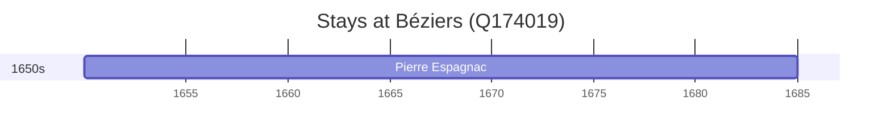

# Béziers (Q174019)

*city in Hérault, Occitanie, France*

Wikidata: [Q174019](https://www.wikidata.org/wiki/Q174019)

1 occurrence(s) across 1 transcribed value(s), 1 person(s).

**Transcribed variants:**

- `Béziers` (1×, 1650–1650)

| Date | Variant | Person | Type | Entity id | Real entity |
|------|---------|--------|------|-----------|-------------|
| 1650-01-07 | Béziers | Pierre Espagnac | nascimento | [deh-pierre-espagnac](deh-pierre-espagnac) | — |

