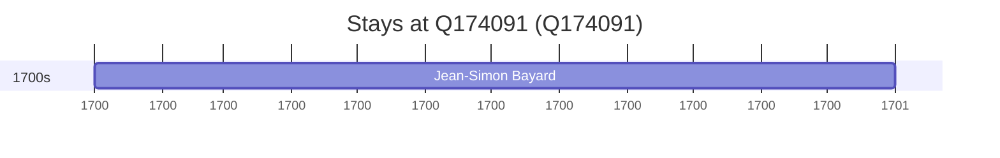

# Q174091

*(fetch error: HTTP Error 429: Too Many Requests)*

Wikidata: [Q174091](https://www.wikidata.org/wiki/Q174091)

1 occurrence(s) across 1 transcribed value(s), 1 person(s).

**Transcribed variants:**

- `Changsha` (1×, 1700–1700)

| Date | Variant | Person | Type | Entity id | Real entity |
|------|---------|--------|------|-----------|-------------|
| 1700 | Changsha | Jean-Simon Bayard | estadia | [deh-jean-simon-bayard](deh-jean-simon-bayard) | — |

