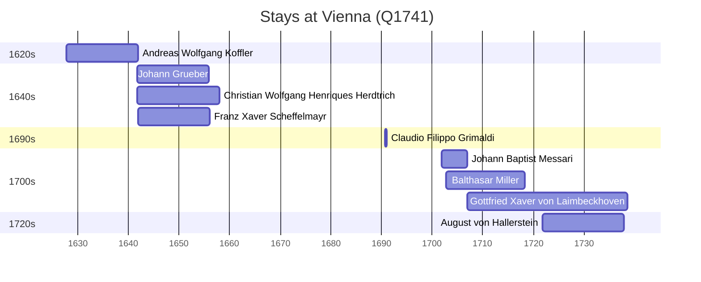

# Vienna (Q1741)

*capital of and state in Austria*

Wikidata: [Q1741](https://www.wikidata.org/wiki/Q1741)

11 occurrence(s) across 1 transcribed value(s), 9 person(s).

**Transcribed variants:**

- `Viena` (11×, 1627–1722)

| Date | Variant | Person | Type | Entity id | Real entity |
|------|---------|--------|------|-----------|-------------|
| 1627-10-16 | Viena | Andreas Wolfgang Koffler | jesuita-entrada | [deh-andreas-wolfgang-koffler](deh-andreas-wolfgang-koffler) | — |
| 1641-10-13 | Viena | Johann Grueber | jesuita-entrada | [deh-johann-grueber](deh-johann-grueber) | — |
| 1641-10-27 | Viena | Christian Wolfgang Henriques Herdtrich | jesuita-entrada | [deh-christian-wolfgang-henriques-herdtrich](deh-christian-wolfgang-henriques-herdtrich) | [rp669413](rp669413) |
| 1641-11-26 | Viena | Franz Xaver Scheffelmayr | jesuita-entrada | [deh-franz-xaver-scheffelmayr](deh-franz-xaver-scheffelmayr) | — |
| 1654-12-19 | Viena | Franz Xaver Scheffelmayr | estadia | [deh-franz-xaver-scheffelmayr](deh-franz-xaver-scheffelmayr) | — |
| 1690-10 | Viena | Claudio Filippo Grimaldi | estadia | [deh-claudio-filippo-grimaldi](deh-claudio-filippo-grimaldi) | — |
| 1701-12-07 | Viena | Johann Baptist Messari | jesuita-entrada | [deh-johann-baptist-messari](deh-johann-baptist-messari) | — |
| 1702-10-27 | Viena | Balthasar Miller | jesuita-entrada | [deh-balthasar-miller](deh-balthasar-miller) | — |
| 1707-01-09 | Viena | Gottfried Xaver von Laimbeckhoven | nascimento | [deh-gottfried-xaver-von-laimbeckhoven](deh-gottfried-xaver-von-laimbeckhoven) | — |
| 1721-10-27 | Viena | August von Hallerstein | jesuita-entrada | [deh-august-von-hallerstein](deh-august-von-hallerstein) | — |
| 1722-01-27 | Viena | Gottfried Xaver von Laimbeckhoven | jesuita-entrada | [deh-gottfried-xaver-von-laimbeckhoven](deh-gottfried-xaver-von-laimbeckhoven) | — |

### Co-presence

These persons were plausibly at this place during overlapping periods (interval estimation from stay dates; rough — see method note below).

| Period | Persons |
|--------|---------|
| 1640s | [Andreas Wolfgang Koffler](deh-andreas-wolfgang-koffler), [Christian Wolfgang Henriques Herdtrich](rp669413), [Franz Xaver Scheffelmayr](deh-franz-xaver-scheffelmayr), [Johann Grueber](deh-johann-grueber) |
| 1700s | [Balthasar Miller](deh-balthasar-miller), [Gottfried Xaver von Laimbeckhoven](deh-gottfried-xaver-von-laimbeckhoven), [Johann Baptist Messari](deh-johann-baptist-messari) |
| 1720s | [August von Hallerstein](deh-august-von-hallerstein), [Gottfried Xaver von Laimbeckhoven](deh-gottfried-xaver-von-laimbeckhoven) |

*9 overlapping pair(s) involving 8 person(s). Method: interval start = stay event date; end = next embarque/partida/different-place event, or death, or +15yr cap.*

