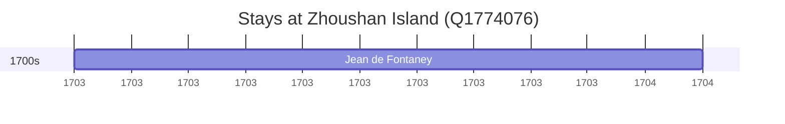

# Zhoushan Island (Q1774076)

*island in People's Republic of China*

Wikidata: [Q1774076](https://www.wikidata.org/wiki/Q1774076)

1 occurrence(s) across 1 transcribed value(s), 1 person(s).

**Transcribed variants:**

- `Ilhas Chushan (Tcheou-chan)` (1×, 1703–1703)

| Date | Variant | Person | Type | Entity id | Real entity |
|------|---------|--------|------|-----------|-------------|
| 1703-03-01 | Ilhas Chushan (Tcheou-chan) | Jean de Fontaney | estadia | [deh-jean-de-fontaney](deh-jean-de-fontaney) | — |

