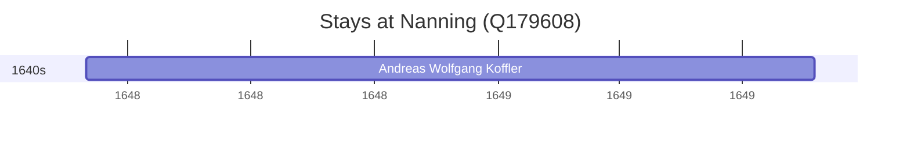

# Nanning (Q179608)

*capital of Guangxi, China*

Wikidata: [Q179608](https://www.wikidata.org/wiki/Q179608)

1 occurrence(s) across 1 transcribed value(s), 1 person(s).

**Transcribed variants:**

- `Nanning` (1×, 1648–1648)

| Date | Variant | Person | Type | Entity id | Real entity |
|------|---------|--------|------|-----------|-------------|
| 1648-03 | Nanning | Andreas Wolfgang Koffler | estadia | [deh-andreas-wolfgang-koffler](deh-andreas-wolfgang-koffler) | — |

