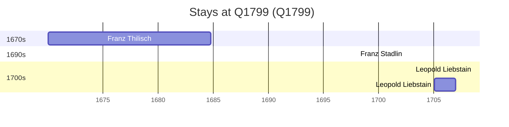

# Q1799

*(fetch error: HTTP Error 429: Too Many Requests)*

Wikidata: [Q1799](https://www.wikidata.org/wiki/Q1799)

4 occurrence(s) across 1 transcribed value(s), 3 person(s).

**Transcribed variants:**

- `Wrocław` (4×, 1670–1705)

| Date | Variant | Person | Type | Entity id | Real entity |
|------|---------|--------|------|-----------|-------------|
| 1670-01-06 | Wrocław | Franz Thilisch | nascimento | [deh-franz-thilisch](deh-franz-thilisch) | — |
| 1698-02-02 | Wrocław | Franz Stadlin | jesuita-votos-local | [deh-franz-stadlin](deh-franz-stadlin) | — |
| 1703-02-02 | Wrocław | Leopold Liebstain | jesuita-votos-local | [deh-leopold-liebstain](deh-leopold-liebstain) | — |
| 1705-01-26 | Wrocław | Leopold Liebstain | estadia | [deh-leopold-liebstain](deh-leopold-liebstain) | — |

