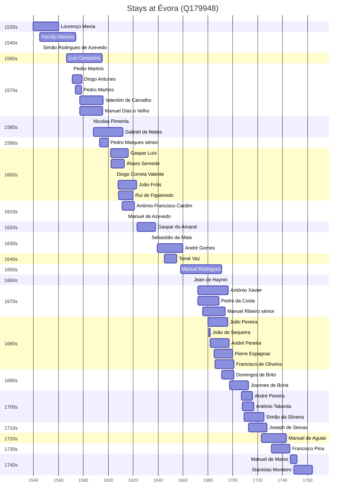

# Évora (Q179948)

*municipality in Portugal*

Wikidata: [Q179948](https://www.wikidata.org/wiki/Q179948)

47 occurrence(s) across 3 transcribed value(s), 42 person(s).

**Transcribed variants:**

- `Évora` (45×, 1539–1754)
- `Évora (colégio)` (1×, 1632–1632)
- `Évora (Universidade)` (1×, undated)

| Date | Variant | Person | Type | Entity id | Real entity |
|------|---------|--------|------|-----------|-------------|
| 1539-08 | Évora | Lourenço Mexia | nascimento | [deh-lourenco-mexia](deh-lourenco-mexia) | — |
| 1545 | Évora | Fernão Martins | nascimento | [deh-fernao-martins](deh-fernao-martins) | — |
| 1545-12-25 | Évora | Simão Rodrigues de Azevedo | jesuita-votos-local | [deh-simao-rodrigues-de-azevedo](deh-simao-rodrigues-de-azevedo) | — |
| 1566-07-14 | Évora | Luís Cerqueira | jesuita-entrada | [deh-luis-cerqueira](deh-luis-cerqueira) | — |
| 1570-04-23 | Évora | Pedro Martins | jesuita-votos-local | [deh-pedro-martins](deh-pedro-martins) | — |
| 1571-03-04 | Évora | Diogo Antunes | jesuita-entrada | [deh-diogo-antunes](deh-diogo-antunes) | — |
| 1573-07-26 | Évora | Pedro Martins | estadia | [deh-pedro-martins](deh-pedro-martins) | — |
| 1576-12-04 | Évora | Valentim de Carvalho | jesuita-entrada | [deh-valentim-de-carvalho](deh-valentim-de-carvalho) | — |
| 1576-12-30 | Évora | Manuel Dias, o Velho | jesuita-entrada | [deh-manuel-dias-o-velho](deh-manuel-dias-o-velho) | — |
| 1586-05-28 | Évora | Nicolau Pimenta | jesuita-votos-local | [deh-nicolau-pimenta](deh-nicolau-pimenta) | — |
| 1587-01-25 | Évora | Luís Cerqueira | jesuita-votos-local | [deh-luis-cerqueira](deh-luis-cerqueira) | — |
| 1588 | Évora | Gabriel de Matos | jesuita-entrada | [deh-gabriel-de-matos](deh-gabriel-de-matos) | — |
| 1593-01 | Évora | Pedro Marques, sénior | jesuita-entrada | [deh-pedro-marques-senior](deh-pedro-marques-senior) | — |
| 1594 | Évora | Luís Cerqueira | estadia | [deh-luis-cerqueira](deh-luis-cerqueira) | — |
| 1602 | Évora | Gaspar Luís | jesuita-entrada | [deh-gaspar-luis](deh-gaspar-luis) | — |
| 1602-04-30 | Évora | Álvaro Semedo | jesuita-entrada | [deh-alvaro-semedo](deh-alvaro-semedo) | — |
| 1605-01-30 | Évora | Diogo Correia Valente | jesuita-votos-local | [deh-diogo-correia-valente](deh-diogo-correia-valente) | — |
| 1608 | Évora | João Fróis | jesuita-entrada | [deh-joao-frois](deh-joao-frois) | — |
| 1608-02-17 | Évora | Rui de Figueiredo | jesuita-entrada | [deh-rui-de-figueiredo](deh-rui-de-figueiredo) | — |
| 1611-02-24 | Évora | António Francisco Cardim | jesuita-entrada | [deh-antonio-francisco-cardim](deh-antonio-francisco-cardim) | [rp536947](rp536947) |
| 1614-02-11 | Évora | Manuel de Azevedo | jesuita-votos-local | [deh-manuel-de-azevedo](deh-manuel-de-azevedo) | — |
| 1632-12-08 | Évora (colégio) | Sebastião da Maia | jesuita-votos-local | [deh-sebastiao-da-maia](deh-sebastiao-da-maia) | — |
| 1639-07-11 | Évora | André Gomes | jesuita-entrada | [deh-andre-gomes](deh-andre-gomes) | — |
| 1645 | Évora | Tomé Vaz | jesuita-entrada | [deh-tome-vaz](deh-tome-vaz) | — |
| 1658-02-23 | Évora | Manuel Rodrigues | jesuita-entrada | [deh-manuel-rodrigues-ii](deh-manuel-rodrigues-ii) | — |
| 1667-02-02 | Évora | Jean de Haynin | jesuita-votos-local | [deh-jean-de-haynin](deh-jean-de-haynin) | — |
| 1672 | Évora | António Xavier | nascimento | [deh-antonio-xavier](deh-antonio-xavier) | — |
| 1672-01-05 | Évora | Pedro da Costa | jesuita-entrada | [deh-pedro-da-costa-i](deh-pedro-da-costa-i) | — |
| 1676 | Évora | Manuel Ribeiro, sénior | nascimento | [deh-manuel-ribeiro-senior](deh-manuel-ribeiro-senior) | — |
| 1680-03-24 | Évora | João Pereira | jesuita-entrada | [deh-joao-pereira-ii](deh-joao-pereira-ii) | — |
| 1680-10-24 | Évora | João de Sequeira | jesuita-entrada | [deh-joao-de-sequeira](deh-joao-de-sequeira) | — |
| 1682 | Évora | André Pereira | nascimento | [deh-andre-pereira-ref2](deh-andre-pereira-ref2) | — |
| 1685 | Évora | Pierre Espagnac | estadia | [deh-pierre-espagnac](deh-pierre-espagnac) | — |
| 1685-11-17 | Évora | Francisco de Oliveira | jesuita-entrada | [deh-francisco-de-oliveira-ref1](deh-francisco-de-oliveira-ref1) | — |
| 1691-02-28 | Évora | Domingos de Brito | jesuita-entrada | [deh-domingos-de-brito](deh-domingos-de-brito) | — |
| 1697-07-10 | Évora | Joannes de Boria | jesuita-entrada | [deh-joao-de-borgia-kouo-ref4](deh-joao-de-borgia-kouo-ref4) | — |
| 1698 | Évora | André Pereira | jesuita-entrada | [deh-andre-pereira-ref2](deh-andre-pereira-ref2) | — |
| 1707-09-17 | Évora | António Taborda | jesuita-entrada | [deh-antonio-taborda](deh-antonio-taborda) | — |
| 1709-03-11 | Évora | Simão da Silveira | jesuita-entrada | [deh-simao-da-silveira](deh-simao-da-silveira) | — |
| 1712-08-06 | Évora | Joseph de Seixas | jesuita-entrada | [deh-joao-de-seixas-ref4](deh-joao-de-seixas-ref4) | — |
| 1723 | Évora | Manuel de Aguiar | jesuita-entrada | [deh-manuel-de-aguiar](deh-manuel-de-aguiar) | — |
| 1730-12-18 | Évora | Francisco Pina | nascimento | [deh-francisco-pina](deh-francisco-pina) | — |
| 1746-04-05 | Évora | Manuel de Matos | jesuita-entrada | [deh-manuel-de-matos](deh-manuel-de-matos) | — |
| 1749 | Évora | Stanislas Monteiro | estadia | [deh-stanislas-monteiro-ref1](deh-stanislas-monteiro-ref1) | — |
| 1754 | Évora | Francisco Pina | estadia | [deh-francisco-pina](deh-francisco-pina) | — |
| <1623-03-24 | Évora | Gaspar do Amaral | estadia-x | [deh-gaspar-do-amaral](deh-gaspar-do-amaral) | — |
| >1707:<1716-03-14 | Évora (Universidade) | André Pereira | estadia | [deh-andre-pereira](deh-andre-pereira) | — |

### Co-presence

These persons were plausibly at this place during overlapping periods (interval estimation from stay dates; rough — see method note below).

| Period | Persons |
|--------|---------|
| 1540s | [Fernão Martins](deh-fernao-martins), [Lourenço Mexia](deh-lourenco-mexia), [Simão Rodrigues de Azevedo](deh-simao-rodrigues-de-azevedo) |
| 1560s | [Fernão Martins](deh-fernao-martins), [Luís Cerqueira](deh-luis-cerqueira) |
| 1570s | [Diogo Antunes](deh-diogo-antunes), [Fernão Martins](deh-fernao-martins), [Luís Cerqueira](deh-luis-cerqueira), [Manuel Dias, o Velho](deh-manuel-dias-o-velho), [Pedro Martins](deh-pedro-martins), [Valentim de Carvalho](deh-valentim-de-carvalho) |
| 1580s | [Gabriel de Matos](deh-gabriel-de-matos), [Luís Cerqueira](deh-luis-cerqueira), [Manuel Dias, o Velho](deh-manuel-dias-o-velho), [Nicolau Pimenta](deh-nicolau-pimenta), [Valentim de Carvalho](deh-valentim-de-carvalho) |
| 1590s | [Gabriel de Matos](deh-gabriel-de-matos), [Luís Cerqueira](deh-luis-cerqueira), [Manuel Dias, o Velho](deh-manuel-dias-o-velho), [Pedro Marques, sénior](deh-pedro-marques-senior), [Valentim de Carvalho](deh-valentim-de-carvalho) |
| 1600s | [Diogo Correia Valente](deh-diogo-correia-valente), [Gabriel de Matos](deh-gabriel-de-matos), [Gaspar Luís](deh-gaspar-luis), [João Fróis](deh-joao-frois), [Rui de Figueiredo](deh-rui-de-figueiredo), [Álvaro Semedo](deh-alvaro-semedo) |
| 1610s | [António Francisco Cardim](rp536947), [Gabriel de Matos](deh-gabriel-de-matos), [Gaspar Luís](deh-gaspar-luis), [João Fróis](deh-joao-frois), [Manuel de Azevedo](deh-manuel-de-azevedo), [Rui de Figueiredo](deh-rui-de-figueiredo), [Álvaro Semedo](deh-alvaro-semedo) |
| 1630s | [Gaspar do Amaral](deh-gaspar-do-amaral), [Sebastião da Maia](deh-sebastiao-da-maia) |
| 1640s | [André Gomes](deh-andre-gomes), [Tomé Vaz](deh-tome-vaz) |
| 1650s | [André Gomes](deh-andre-gomes), [Manuel Rodrigues](deh-manuel-rodrigues-ii) |
| 1660s | [Jean de Haynin](deh-jean-de-haynin), [Manuel Rodrigues](deh-manuel-rodrigues-ii) |
| 1670s | [António Xavier](deh-antonio-xavier), [Manuel Ribeiro, sénior](deh-manuel-ribeiro-senior), [Manuel Rodrigues](deh-manuel-rodrigues-ii), [Pedro da Costa](deh-pedro-da-costa-i) |
| 1680s | [António Xavier](deh-antonio-xavier), [João Pereira](deh-joao-pereira-ii), [João de Sequeira](deh-joao-de-sequeira), [Manuel Ribeiro, sénior](deh-manuel-ribeiro-senior), [Manuel Rodrigues](deh-manuel-rodrigues-ii), [Pedro da Costa](deh-pedro-da-costa-i) |
| 1690s | [António Xavier](deh-antonio-xavier), [Domingos de Brito](deh-domingos-de-brito), [João Pereira](deh-joao-pereira-ii), [Manuel Ribeiro, sénior](deh-manuel-ribeiro-senior) |
| 1700s | [André Pereira](deh-andre-pereira), [António Taborda](deh-antonio-taborda), [Simão da Silveira](deh-simao-da-silveira) |
| 1720s | [Manuel de Aguiar](deh-manuel-de-aguiar), [Simão da Silveira](deh-simao-da-silveira) |

*76 overlapping pair(s) involving 34 person(s). Method: interval start = stay event date; end = next embarque/partida/different-place event, or death, or +15yr cap.*

