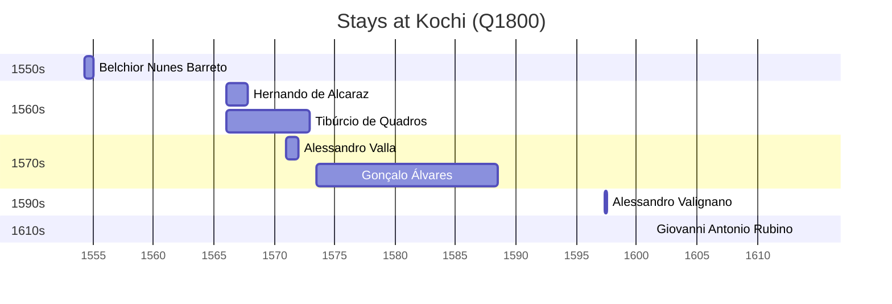

# Kochi (Q1800)

*city in Kerala, India*

Wikidata: [Q1800](https://www.wikidata.org/wiki/Q1800)

13 occurrence(s) across 2 transcribed value(s), 11 person(s).

**Transcribed variants:**

- `Cochim` (11×, 1554–1613)
- `Reitor de Cochim` (2×, 1569–1572)

| Date | Variant | Person | Type | Entity id | Real entity |
|------|---------|--------|------|-----------|-------------|
| — | Cochim | Pedro de Fernandes | estadia | [deh-pedro-de-francisco-ref1](deh-pedro-de-francisco-ref1) | — |
| 1554-04-16 | Cochim | Belchior Nunes Barreto | estadia-x | [deh-belchior-nunes-barreto](deh-belchior-nunes-barreto) | [rp606650](rp606650) |
| 1560-01-06 | Cochim | Francisco Pérez | jesuita-votos-local | [deh-francisco-perez](deh-francisco-perez) | [rp892854](rp892854) |
| 1566 | Cochim | Tibúrcio de Quadros | estadia | [deh-tiburcio-de-quadros](deh-tiburcio-de-quadros) | — |
| 1569 | Reitor de Cochim | Manuel Teixeira | jesuita-cargo | [deh-manuel-teixeira](deh-manuel-teixeira) | [rp212210](rp212210) |
| 1571 | Cochim | Alessandro Valla | estadia | [deh-alessandro-valla](deh-alessandro-valla) | — |
| 1572 | Reitor de Cochim | Manuel Teixeira | jesuita-cargo | [deh-manuel-teixeira](deh-manuel-teixeira) | [rp212210](rp212210) |
| 1580-07-25 | Cochim | Matteo Ricci | jesuita-ordenacao-padre | [deh-matteo-ricci](deh-matteo-ricci) | [rp302155](rp302155) |
| 1580-07-26 | Cochim | Matteo Ricci | estadia | [deh-matteo-ricci](deh-matteo-ricci) | [rp302155](rp302155) |
| 1597-04-29 | Cochim | Alessandro Valignano | estadia | [deh-alessandro-valignano](deh-alessandro-valignano) | — |
| 1613-05-26 | Cochim | Giovanni Antonio Rubino | jesuita-votos-local | [deh-giovanni-antonio-rubino](deh-giovanni-antonio-rubino) | — |
| >1566:<1567-10-27 | Cochim | Hernando de Alcaraz | estadia | [deh-hernando-de-alcaraz](deh-hernando-de-alcaraz) | — |
| >1568-12-15:<1572 | Cochim | Gonçalo Álvares | estadia | [deh-goncalo-alvares](deh-goncalo-alvares) | [rp127859](rp127859) |

### Co-presence

These persons were plausibly at this place during overlapping periods (interval estimation from stay dates; rough — see method note below).

| Period | Persons |
|--------|---------|
| 1560s | [Hernando de Alcaraz](deh-hernando-de-alcaraz), [Tibúrcio de Quadros](deh-tiburcio-de-quadros) |
| 1570s | [Alessandro Valla](deh-alessandro-valla), [Tibúrcio de Quadros](deh-tiburcio-de-quadros) |

*2 overlapping pair(s) involving 3 person(s). Method: interval start = stay event date; end = next embarque/partida/different-place event, or death, or +15yr cap.*

