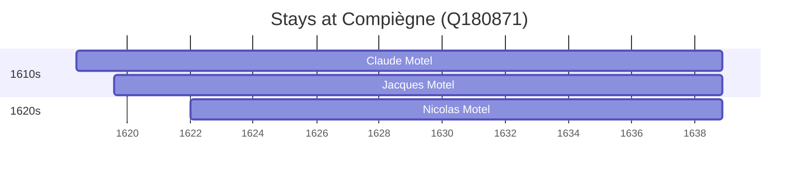

# Compiègne (Q180871)

*French commune in Oise*

Wikidata: [Q180871](https://www.wikidata.org/wiki/Q180871)

3 occurrence(s) across 1 transcribed value(s), 3 person(s).

**Transcribed variants:**

- `Compiègne` (3×, 1618–1622)

| Date | Variant | Person | Type | Entity id | Real entity |
|------|---------|--------|------|-----------|-------------|
| 1618-05-27 | Compiègne | Claude Motel | nascimento | [deh-claude-motel](deh-claude-motel) | — |
| 1619-08-10 | Compiègne | Jacques Motel | nascimento | [deh-jacques-motel](deh-jacques-motel) | — |
| 1622-01-07 | Compiègne | Nicolas Motel | nascimento | [deh-nicolas-motel](deh-nicolas-motel) | — |

### Co-presence

These persons were plausibly at this place during overlapping periods (interval estimation from stay dates; rough — see method note below).

| Period | Persons |
|--------|---------|
| 1610s | [Claude Motel](deh-claude-motel), [Jacques Motel](deh-jacques-motel) |
| 1620s | [Claude Motel](deh-claude-motel), [Jacques Motel](deh-jacques-motel), [Nicolas Motel](deh-nicolas-motel) |

*3 overlapping pair(s) involving 3 person(s). Method: interval start = stay event date; end = next embarque/partida/different-place event, or death, or +15yr cap.*

