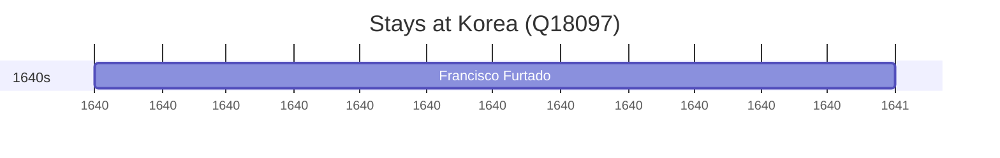

# Korea (Q18097)

*region in East Asia*

Wikidata: [Q18097](https://www.wikidata.org/wiki/Q18097)

1 occurrence(s) across 1 transcribed value(s), 1 person(s).

**Transcribed variants:**

- `Coreia` (1×, 1640–1640)

| Date | Variant | Person | Type | Entity id | Real entity |
|------|---------|--------|------|-----------|-------------|
| 1640 | Coreia | Francisco Furtado | estadia | [deh-francisco-furtado](deh-francisco-furtado) | — |

