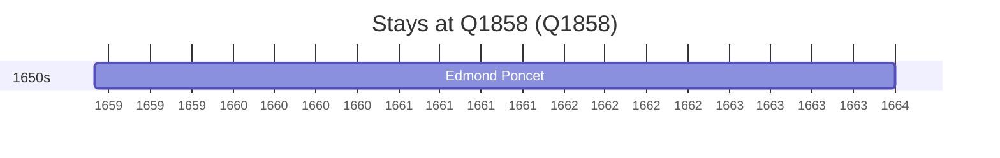

# Q1858

*(fetch error: HTTP Error 429: Too Many Requests)*

Wikidata: [Q1858](https://www.wikidata.org/wiki/Q1858)

1 occurrence(s) across 1 transcribed value(s), 1 person(s).

**Transcribed variants:**

- `Hanoi` (1×, 1659–1659)

| Date | Variant | Person | Type | Entity id | Real entity |
|------|---------|--------|------|-----------|-------------|
| 1659-03 | Hanoi | Edmond Poncet | estadia | [deh-edmond-poncet](deh-edmond-poncet) | — |

