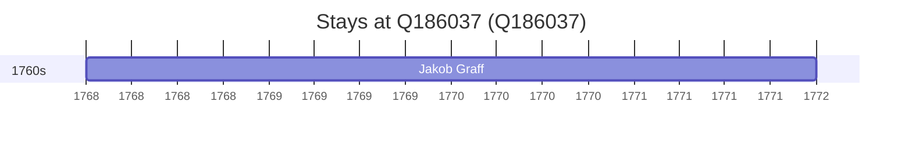

# Q186037

*(fetch error: HTTP Error 429: Too Many Requests)*

Wikidata: [Q186037](https://www.wikidata.org/wiki/Q186037)

2 occurrence(s) across 1 transcribed value(s), 1 person(s).

**Transcribed variants:**

- `Sankt Goar, Alemanha` (2×, 1768–1772)

| Date | Variant | Person | Type | Entity id | Real entity |
|------|---------|--------|------|-----------|-------------|
| 1768 | Sankt Goar, Alemanha | Jakob Graff | estadia | [deh-jakob-graff](deh-jakob-graff) | — |
| 1772 | Sankt Goar, Alemanha | Jakob Graff | estadia | [deh-jakob-graff](deh-jakob-graff) | — |

