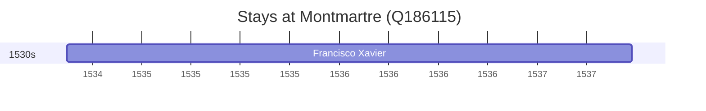

# Montmartre (Q186115)

*large hill in Paris's northern 18th arrondissement*

Wikidata: [Q186115](https://www.wikidata.org/wiki/Q186115)

2 occurrence(s) across 1 transcribed value(s), 1 person(s).

**Transcribed variants:**

- `Paris` (2×, 1534–1534)

| Date | Variant | Person | Type | Entity id | Real entity |
|------|---------|--------|------|-----------|-------------|
| 1534-08-15 | Paris | Francisco Xavier | estadia | [deh-francisco-xavier](deh-francisco-xavier) | — |
| 1534-08-15 | Paris | Francisco Xavier | jesuita-fundador | [deh-francisco-xavier](deh-francisco-xavier) | — |

