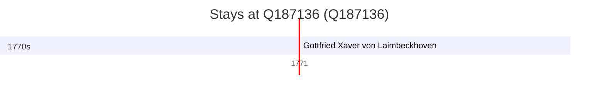

# Q187136

*(fetch error: HTTP Error 429: Too Many Requests)*

Wikidata: [Q187136](https://www.wikidata.org/wiki/Q187136)

1 occurrence(s) across 1 transcribed value(s), 1 person(s).

**Transcribed variants:**

- `Honan, Luyi hien` (1×, 1771–1771)

| Date | Variant | Person | Type | Entity id | Real entity |
|------|---------|--------|------|-----------|-------------|
| 1771 | Honan, Luyi hien | Gottfried Xaver von Laimbeckhoven | estadia | [deh-gottfried-xaver-von-laimbeckhoven](deh-gottfried-xaver-von-laimbeckhoven) | — |

